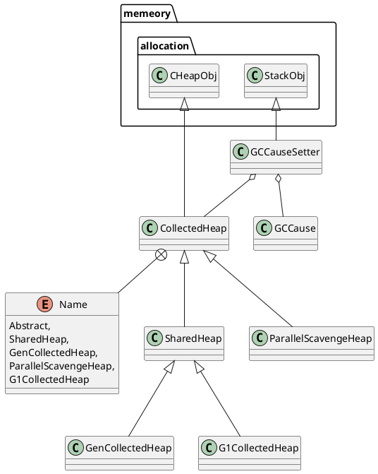

hotspot/src/share/vm/gc_interface/collectedHeap.hpp
## hirerachy
```
CollectedHeap
  SharedHeap
    GenCollectedHeap
    G1CollectedHeap
  ParallelScavengeHeap
```

## define

```plantuml
@startuml

package memeory.allocation {
    class CHeapObj
    class StackObj
}

CHeapObj ^-- CollectedHeap

class CollectedHeap
CollectedHeap +-- Name
CollectedHeap ^-- SharedHeap
CollectedHeap ^-- ParallelScavengeHeap

SharedHeap ^-- GenCollectedHeap
SharedHeap ^-- G1CollectedHeap

class GCCauseSetter
StackObj ^-- GCCauseSetter
GCCauseSetter o-- CollectedHeap
GCCauseSetter o-- GCCause

enum Name {
    Abstract,
    SharedHeap,
    GenCollectedHeap,
    ParallelScavengeHeap,
    G1CollectedHeap
}

@enduml
```
