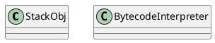

hotspot/src/share/vm/interpreter/bytecodeInterpreter.cpp

## define


## methods

### 对象的创建
1. 类加载
2. 分配内存 指针碰撞，空闲列表；线程安全问题，加锁或者TLAB
3. 内存空间初始化
4. 设置对象元数据信息、对象哈希码、分代年龄等

```cpp
CASE(_new): {
        u2 index = Bytes::get_Java_u2(pc+1);
        ConstantPool* constants = istate->method()->constants();
        if (!constants->tag_at(index).is_unresolved_klass()) {
          // Make sure klass is initialized and doesn't have a finalizer
          Klass* entry = constants->slot_at(index).get_klass();
          assert(entry->is_klass(), "Should be resolved klass");
          Klass* k_entry = (Klass*) entry;
          assert(k_entry->oop_is_instance(), "Should be InstanceKlass");
          InstanceKlass* ik = (InstanceKlass*) k_entry;
          if ( ik->is_initialized() && ik->can_be_fastpath_allocated() ) {
            size_t obj_size = ik->size_helper();
            oop result = NULL;
            // If the TLAB isn't pre-zeroed then we'll have to do it
            bool need_zero = !ZeroTLAB;
            // 线程本地分配缓冲
            if (UseTLAB) {
              result = (oop) THREAD->tlab().allocate(obj_size);
            }
            if (result == NULL) {
              need_zero = true;
              // Try allocate in shared eden
        retry: // CAS重试方式分配内存
              HeapWord* compare_to = *Universe::heap()->top_addr();
              HeapWord* new_top = compare_to + obj_size;
              if (new_top <= *Universe::heap()->end_addr()) {
                if (Atomic::cmpxchg_ptr(new_top, Universe::heap()->top_addr(), compare_to) != compare_to) {
                  goto retry;
                }
                result = (oop) compare_to;
              }
            }
            if (result != NULL) {
              // Initialize object (if nonzero size and need) and then the header
              if (need_zero ) {
                HeapWord* to_zero = (HeapWord*) result + sizeof(oopDesc) / oopSize;
                obj_size -= sizeof(oopDesc) / oopSize;
                if (obj_size > 0 ) {
                  memset(to_zero, 0, obj_size * HeapWordSize);
                }
              }
              // 是否启用偏向锁设置对象头信息
              if (UseBiasedLocking) {
                result->set_mark(ik->prototype_header());
              } else {
                result->set_mark(markOopDesc::prototype());
              }
              result->set_klass_gap(0);
              result->set_klass(k_entry);
              // 将对象引入栈，继续执行下一条指令
              SET_STACK_OBJECT(result, 0);
              UPDATE_PC_AND_TOS_AND_CONTINUE(3, 1);
            }
          }
        }
        // Slow case allocation
        CALL_VM(InterpreterRuntime::_new(THREAD, METHOD->constants(), index),
                handle_exception);
        SET_STACK_OBJECT(THREAD->vm_result(), 0);
        THREAD->set_vm_result(NULL);
        UPDATE_PC_AND_TOS_AND_CONTINUE(3, 1);
    }
```
