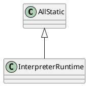

hotspot/src/share/vm/interpreter/interpreterRuntime.hpp

## hpp


### synchronized
[JVM源码分析之synchronized实现](https://www.jianshu.com/p/c5058b6fe8e5)
```c++
  // Synchronization
  static void    monitorenter(JavaThread* thread, BasicObjectLock* elem);
  static void    monitorexit (JavaThread* thread, BasicObjectLock* elem);

  static void    throw_illegal_monitor_state_exception(JavaThread* thread);
  static void    new_illegal_monitor_state_exception(JavaThread* thread);
```

## cpp
```c++
//------------------------------------------------------------------------------------------------------------------------
// Synchronization
//
// The interpreter's synchronization code is factored out so that it can
// be shared by method invocation and synchronized blocks.
//%note synchronization_3

//%note monitor_1
IRT_ENTRY_NO_ASYNC(void, InterpreterRuntime::monitorenter(JavaThread* thread, BasicObjectLock* elem))
#ifdef ASSERT
  thread->last_frame().interpreter_frame_verify_monitor(elem);
#endif
  if (PrintBiasedLockingStatistics) {
    Atomic::inc(BiasedLocking::slow_path_entry_count_addr());
  }
  Handle h_obj(thread, elem->obj());
  assert(Universe::heap()->is_in_reserved_or_null(h_obj()),
         "must be NULL or an object");
  if (UseBiasedLocking) { // 开启偏向锁
    // Retry fast entry if bias is revoked to avoid unnecessary inflation
    ObjectSynchronizer::fast_enter(h_obj, elem->lock(), true, CHECK);
  } else {
    ObjectSynchronizer::slow_enter(h_obj, elem->lock(), CHECK);
  }
  assert(Universe::heap()->is_in_reserved_or_null(elem->obj()),
         "must be NULL or an object");
#ifdef ASSERT
  thread->last_frame().interpreter_frame_verify_monitor(elem);
#endif
IRT_END


//%note monitor_1
IRT_ENTRY_NO_ASYNC(void, InterpreterRuntime::monitorexit(JavaThread* thread, BasicObjectLock* elem))
#ifdef ASSERT
  thread->last_frame().interpreter_frame_verify_monitor(elem);
#endif
  Handle h_obj(thread, elem->obj());
  assert(Universe::heap()->is_in_reserved_or_null(h_obj()),
         "must be NULL or an object");
  if (elem == NULL || h_obj()->is_unlocked()) {
    THROW(vmSymbols::java_lang_IllegalMonitorStateException());
  }
  ObjectSynchronizer::slow_exit(h_obj(), elem->lock(), thread);
  // Free entry. This must be done here, since a pending exception might be installed on
  // exit. If it is not cleared, the exception handling code will try to unlock the monitor again.
  elem->set_obj(NULL);
#ifdef ASSERT
  thread->last_frame().interpreter_frame_verify_monitor(elem);
#endif
IRT_END


IRT_ENTRY(void, InterpreterRuntime::throw_illegal_monitor_state_exception(JavaThread* thread))
  THROW(vmSymbols::java_lang_IllegalMonitorStateException());
IRT_END
```

