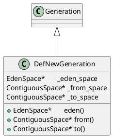

DefNewGeneration is a young generation containing eden, from- and to-space.

## define

```plantuml
@startuml

Generation ^-- DefNewGeneration
class DefNewGeneration {
    EdenSpace*       _eden_space
    ContiguousSpace* _from_space
    ContiguousSpace* _to_space
    
    + EdenSpace*       eden()
    + ContiguousSpace* from()
    + ContiguousSpace* to()
}

@enduml
```
