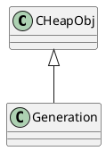

hotspot/src/share/vm/memory/generation.hpp
## hierarchy
```
Generation
    DefNewGeneration
        ParNewGeneration a DefNewGeneration that is collected by several threads
    CardGeneration
        OneContigSpaceCardGeneration
            TenuredGeneration  tenured (old object) space (markSweepCompact)
        ConcurrentMarkSweepGeneration
```

## define

