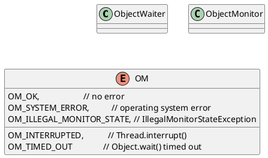

hotspot/src/share/vm/runtime/objectMonitor.cpp



## construct
```c
  ObjectMonitor() {
    _header       = NULL;
    _count        = 0;
    _waiters      = 0,
    _recursions   = 0; // 线程重入锁的次数
    _object       = NULL; // 存储monitor的对象
    _owner        = NULL;
    _WaitSet      = NULL; // 处于wait的线程
    _WaitSetLock  = 0 ;
    _Responsible  = NULL ;
    _succ         = NULL ;
    _cxq          = NULL ;
    FreeNext      = NULL ;
    _EntryList    = NULL ;
    _SpinFreq     = 0 ;
    _SpinClock    = 0 ;
    OwnerIsThread = 0 ;
    _previous_owner_tid = 0;
  }
```