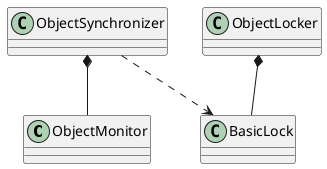

hotspot/src/share/vm/runtime/synchronizer.hpp


## define


## ObjectLocker
```cpp
class ObjectLocker : public StackObj {
 private:
  Thread*   _thread;
  Handle    _obj;
  BasicLock _lock;
  bool      _dolock;   // default true
 public:
  ObjectLocker(Handle obj, Thread* thread, bool doLock = true);
  ~ObjectLocker();

  // Monitor behavior
  void wait      (TRAPS)      { ObjectSynchronizer::wait     (_obj, 0, CHECK); } // wait forever
  void notify_all(TRAPS)      { ObjectSynchronizer::notifyall(_obj,    CHECK); }
  void waitUninterruptibly (TRAPS) { ObjectSynchronizer::waitUninterruptibly (_obj, 0, CHECK);}
  // complete_exit gives up lock completely, returning recursion count
  // reenter reclaims lock with original recursion count
  intptr_t complete_exit(TRAPS) { return  ObjectSynchronizer::complete_exit(_obj, CHECK_0); }
  void reenter(intptr_t recursion, TRAPS) { ObjectSynchronizer::reenter(_obj, recursion, CHECK); }
};
```