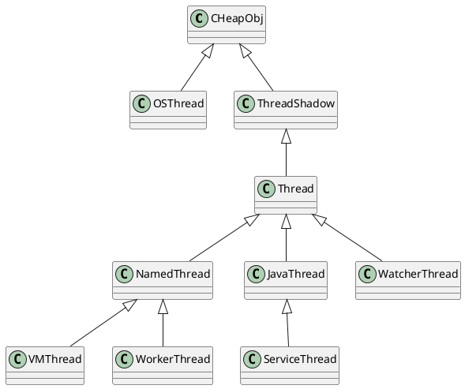

hotspot/src/share/vm/runtime/thread.hpp

```plantuml
@startuml

class CHeapObj

CHeapObj ^-- OSThread
CHeapObj ^-- ThreadShadow

class OSThread


class ThreadShadow
class Thread
class NamedThread
class VMThread

ThreadShadow ^-- Thread

Thread ^-- NamedThread
Thread ^-- JavaThread
Thread ^--WatcherThread

NamedThread ^-- VMThread
NamedThread ^--WorkerThread

JavaThread ^-- ServiceThread

@enduml
```
