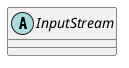

java.io.InputStream

## hierarchy
```
InputStream (java.io)
    2 in Channels (java.nio.channels)
    BlockDataInputStream in ObjectInputStream (java.io)
    ByteArrayInputStream (java.io)
    DecInputStream in Base64 (java.util)
    FileInputStream (java.io)
    FilterInputStream (java.io)
    ObjectInputStream (java.io)
    PeekInputStream in ObjectInputStream (java.io)
    PipedInputStream (java.io)
    SequenceInputStream (java.io)
    StringBufferInputStream (java.io)
    NullInputStream in ProcessBuilder (java.lang)
    VerifierStream in JarVerifier (java.util.jar)
    ZipFileInputStream in ZipFile (java.util.zip)
```

## define


## fields


## methods

### read
```java
    public abstract int read() throws IOException;
    public int read(byte b[]) throws IOException {
        return read(b, 0, b.length);
    }

    public int read(byte b[], int off, int len) throws IOException {
        if (b == null) {
            throw new NullPointerException();
        } else if (off < 0 || len < 0 || len > b.length - off) {
            throw new IndexOutOfBoundsException();
        } else if (len == 0) {
            return 0;
        }

        int c = read();
        if (c == -1) {
            return -1;
        }
        b[off] = (byte)c;

        int i = 1;
        try {
            for (; i < len ; i++) {
                c = read();
                if (c == -1) {
                    break;
                }
                b[off + i] = (byte)c;
            }
        } catch (IOException ee) {
        }
        return i;
    }
```