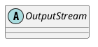

java.io.OutputStream

## hierarchy
```
OutputStream (java.io)
    1 in Channels (java.nio.channels)
    1 in SerializationTester (java.awt.dnd)
    3 in Channels (java.nio.channels)
    BlockDataOutputStream in ObjectOutputStream (java.io)
    ByteArrayOutputStream (java.io)
    FileOutputStream (java.io)
    FilterOutputStream (java.io)
    MeteredStream in FileHandler (java.util.logging)
    NullOutputStream in ProcessBuilder (java.lang)
    ObjectOutputStream (java.io)
    PipedOutputStream (java.io)
```

## define


## fields


## methods

### write
```java
    public abstract void write(int b) throws IOException;

    public void write(byte b[]) throws IOException {
        write(b, 0, b.length);
    }
    
    public void write(byte b[], int off, int len) throws IOException {
        if (b == null) {
            throw new NullPointerException();
        } else if ((off < 0) || (off > b.length) || (len < 0) ||
                   ((off + len) > b.length) || ((off + len) < 0)) {
            throw new IndexOutOfBoundsException();
        } else if (len == 0) {
            return;
        }
        for (int i = 0 ; i < len ; i++) {
            write(b[off + i]);
        }
    }
```

###
```java
    public void flush() throws IOException { }
    public void close() throws IOException { }
```