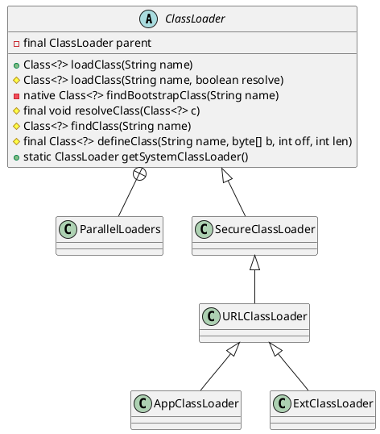

java.lang.ClassLoader
## hierarchy
```
ClassLoader (java.lang)
    SecureClassLoader (java.security)
        URLClassLoader (java.net)
            ExtClassLoader in Launcher (sun.misc)
            AppClassLoader in Launcher (sun.misc)
            AppletClassLoader (sun.applet)
            DeployURLClassLoader (com.sun.deploy.security)
            SALauncherLoader (sun.jvm.hotspot)
            FactoryURLClassLoader (java.net)
            SAJDIClassLoader (sun.jvm.hotspot.jdi)
        JSClassLoader (sun.plugin.javascript)
        NashornLoader (jdk.nashorn.internal.runtime)
            StructureLoader (jdk.nashorn.internal.runtime)
            ScriptLoader (jdk.nashorn.internal.runtime)
    DirectoryLoader (sun.rmi.rmic.iiop)
    ClassPathLoader (sun.rmi.rmic.iiop)
    RBClassLoader in ResourceBundle (java.util)
    ParallelWorldClassLoader (com.sun.istack.internal.tools)
    DelegatingClassLoader (sun.reflect)
    CombinedClassLoader in RMIConnectionImpl (javax.management.remote.rmi)
    ProcImageClassLoader (sun.jvm.hotspot.utilities)
    NoCallStackClassLoader (javax.management.remote.rmi)
    OrderClassLoaders (com.sun.jmx.remote.util)
```

## define


## methods
### findClass
编写自定义classLoader需要重写的方法
### loadClass 
实现了双亲委派，重写之后可以打破双亲委派