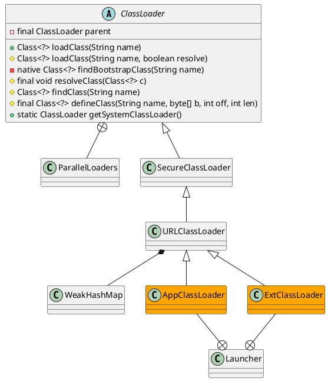

java.lang.ClassLoader

* WeakHashMap
* ConcurrentHashMap
* Vector
* Hashtable
* HashMap
* HashSet
* [sun.misc.Launcher](/docs/10-java/src/rt.jar.src/sun/misc/Launcher.md)

## hierarchy
```
ClassLoader (java.lang)
    SecureClassLoader (java.security)
        URLClassLoader (java.net)
            ExtClassLoader in Launcher (sun.misc)
            AppClassLoader in Launcher (sun.misc)
            AppletClassLoader (sun.applet)
            DeployURLClassLoader (com.sun.deploy.security)
            SALauncherLoader (sun.jvm.hotspot)
            FactoryURLClassLoader (java.net)
            SAJDIClassLoader (sun.jvm.hotspot.jdi)
        JSClassLoader (sun.plugin.javascript)
        NashornLoader (jdk.nashorn.internal.runtime)
            StructureLoader (jdk.nashorn.internal.runtime)
            ScriptLoader (jdk.nashorn.internal.runtime)
    DirectoryLoader (sun.rmi.rmic.iiop)
    ClassPathLoader (sun.rmi.rmic.iiop)
    RBClassLoader in ResourceBundle (java.util)
    ParallelWorldClassLoader (com.sun.istack.internal.tools)
    DelegatingClassLoader (sun.reflect)
    CombinedClassLoader in RMIConnectionImpl (javax.management.remote.rmi)
    ProcImageClassLoader (sun.jvm.hotspot.utilities)
    NoCallStackClassLoader (javax.management.remote.rmi)
    OrderClassLoaders (com.sun.jmx.remote.util)
```

## define



## methods

### loadClass 
实现了双亲委派，重写可破坏双亲委派，继承ClassLoader，重写loadClass()与findClass()

Java默认的类加载顺序
`cached -> parent -> local`
* 从缓存中加载
* 如果缓存中没有，则从父类加载器加载
* 如果父类加载器中没有，则从当前类加载器加载
* 如果没有，则抛出异常

```java
public Class<?> loadClass(String name) throws ClassNotFoundException {
    return loadClass(name, false);
}

protected Class<?> loadClass(String name, boolean resolve)
        throws ClassNotFoundException
{
    synchronized (getClassLoadingLock(name)) {
        // First, check if the class has already been loaded
        Class<?> c = findLoadedClass(name);
        if (c == null) {
            long t0 = System.nanoTime();
            try {
                if (parent != null) {
                    c = parent.loadClass(name, false);
                } else {
                    c = findBootstrapClassOrNull(name);
                }
            } catch (ClassNotFoundException e) {
                // ClassNotFoundException thrown if class not found
                // from the non-null parent class loader
            }

            if (c == null) {
                // If still not found, then invoke findClass in order
                // to find the class.
                long t1 = System.nanoTime();
                c = findClass(name);

                // this is the defining class loader; record the stats
                sun.misc.PerfCounter.getParentDelegationTime().addTime(t1 - t0);
                sun.misc.PerfCounter.getFindClassTime().addElapsedTimeFrom(t1);
                sun.misc.PerfCounter.getFindClasses().increment();
            }
        }
        if (resolve) {
            resolveClass(c);
        }
        return c;
    }
}
```

### findClass
编写自定义classLoader需要重写的方法，沿用双亲委派，继承ClassLoader，重写findClass()
```java
protected Class<?> findClass(String name) throws ClassNotFoundException {
    throw new ClassNotFoundException(name);
}
```

### resolveClass
```java
protected final void resolveClass(Class<?> c) {
    resolveClass0(c);
}

private native void resolveClass0(Class<?> c);
```

### getClassLoadingLock
```java
protected Object getClassLoadingLock(String className) {
    Object lock = this;
    if (parallelLockMap != null) {
        Object newLock = new Object();
        lock = parallelLockMap.putIfAbsent(className, newLock);
        if (lock == null) {
            lock = newLock;
        }
    }
    return lock;
}
```

### findLoadedClass
```java
protected final Class<?> findLoadedClass(String name) {
    if (!checkName(name))
        return null;
    return findLoadedClass0(name);
}

private native final Class<?> findLoadedClass0(String name);
```

## inner class
- native method stack
- java native interface 融合不同的编程语言。Native Method Stack中等级native方法，在Execution Engine运行时加载native libraries。
    异构领域间的通信，可以使用Socket通信（微服务）。
- native library

### NativeLibrary
```java
    static class NativeLibrary {
        // opaque handle to native library, used in native code.
        long handle;
        // the version of JNI environment the native library requires.
        private int jniVersion;
        // the class from which the library is loaded, also indicates
        // the loader this native library belongs.
        private final Class<?> fromClass;
        // the canonicalized name of the native library.
        // or static library name
        String name;
        // Indicates if the native library is linked into the VM
        boolean isBuiltin;
        // Indicates if the native library is loaded
        boolean loaded;
    }
```