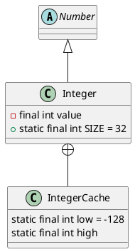

java.lang.Integer

* 自动装箱、拆箱 编译器生成字节码过程中，执行源码`Integer ii = 100;`会自动调用对应包装类的valueOf方法，即`Integer ii = Integer.valueOf(100)`（自动装箱）。
* Integer缓存 -128 - 127

## hierarchy
```
Number (java.lang)
    AtomicInteger (java.util.concurrent.atomic)
    AtomicLong (java.util.concurrent.atomic)
    BigDecimal (java.math)
    BigInteger (java.math)
    Byte (java.lang)
    Double (java.lang)
    Float (java.lang)
    Integer (java.lang)
    Long (java.lang)
    Short (java.lang)
    Striped64 (java.util.concurrent.atomic)
```

## define


## methos

### valueOf
```java
    public static Integer valueOf(int i) {
        if (i >= IntegerCache.low && i <= IntegerCache.high)
            return IntegerCache.cache[i + (-IntegerCache.low)];
        return new Integer(i);
    }
```


## inner class

### IntegerCache
```java
    /**
     * Cache to support the object identity semantics of autoboxing for values between
     * -128 and 127 (inclusive) as required by JLS.
     *
     * The cache is initialized on first usage.  The size of the cache
     * may be controlled by the {@code -XX:AutoBoxCacheMax=<size>} option.
     * During VM initialization, java.lang.Integer.IntegerCache.high property
     * may be set and saved in the private system properties in the
     * sun.misc.VM class.
     */
    private static class IntegerCache {
        static final int low = -128;
        static final int high;
        static final Integer cache[];

        static {
            // high value may be configured by property
            int h = 127;
            String integerCacheHighPropValue =
                sun.misc.VM.getSavedProperty("java.lang.Integer.IntegerCache.high");
            if (integerCacheHighPropValue != null) {
                try {
                    int i = parseInt(integerCacheHighPropValue);
                    i = Math.max(i, 127);
                    // Maximum array size is Integer.MAX_VALUE
                    h = Math.min(i, Integer.MAX_VALUE - (-low) -1);
                } catch( NumberFormatException nfe) {
                    // If the property cannot be parsed into an int, ignore it.
                }
            }
            high = h;

            cache = new Integer[(high - low) + 1];
            int j = low;
            for(int k = 0; k < cache.length; k++)
                cache[k] = new Integer(j++);

            // range [-128, 127] must be interned (JLS7 5.1.7)
            assert IntegerCache.high >= 127;
        }

        private IntegerCache() {}
    }
```