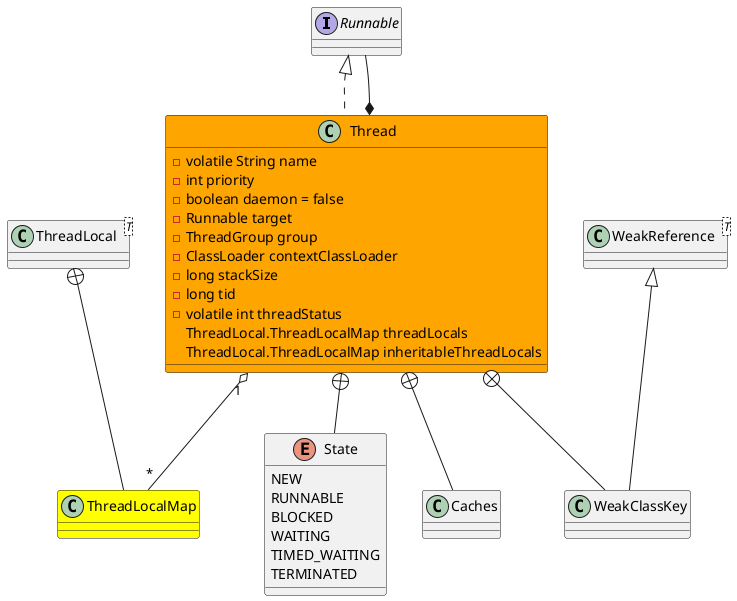
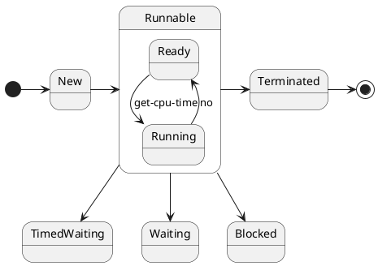

java.lang.Thread

* volatile
* synchronized
* final
* ClassLoader
* WeakReference, priority
* 核心方法
  * join
  * start
  * sleep
  * holdsLock 检测线程是否持有锁
* 线程的同步与异步 任务是否在同一个线程执行
* 线程的阻塞与非阻塞 异步执行任务时，线程是不是会**阻塞**等待任务结果，还是执行后面逻辑
* jps获取pid，jstack pid

## define
* 线程字段
  * 名称
  * 优先级
  * 守护线程
  * 线程组
  * 上下文类加载器
  * 访问控制上下文
  * 线程初始记录
  * 线程本地Map
  * 继承的线程本地Map
  * 栈大小
  * 线程ID tid
  * 线程状态



## thread state
线程状态：新建、可运行（就绪、正在运行）、阻塞、等待、超时等待、终止



## fields

### priority
```java
    private volatile String name;
    private int            priority;
    private Thread         threadQ;
    private long           eetop;

    /* Whether or not to single_step this thread. */
    private boolean     single_step;

    /* Whether or not the thread is a daemon thread. */
    private boolean     daemon = false;

    /* JVM state */
    private boolean     stillborn = false;

    /* What will be run. */
    private Runnable target;

    /* The group of this thread */
    private ThreadGroup group;

    /* The context ClassLoader for this thread */
    private ClassLoader contextClassLoader;

    /* The inherited AccessControlContext of this thread */
    private AccessControlContext inheritedAccessControlContext;
    
```

### ThreadLocal
```java
    ThreadLocal.ThreadLocalMap threadLocals = null;
    ThreadLocal.ThreadLocalMap inheritableThreadLocals = null;
    private long stackSize;
    private long nativeParkEventPointer;
    private long tid;
    private volatile int threadStatus = 0; // 多次调用start()方法 线程状态不合法异常IllegalThreadStateException
```

## methods

### nextThreadNum
```java
    private static int threadInitNumber;
    private static synchronized int nextThreadNum() {
        return threadInitNumber++;
    }
```

### init
```java
    private void init(ThreadGroup g, Runnable target, String name,
                      long stackSize, AccessControlContext acc,
                      boolean inheritThreadLocals) {
        if (name == null) {
            throw new NullPointerException("name cannot be null");
        }

        this.name = name;

        Thread parent = currentThread();
        SecurityManager security = System.getSecurityManager();
        if (g == null) {
            /* Determine if it's an applet or not */

            /* If there is a security manager, ask the security manager
               what to do. */
            if (security != null) {
                g = security.getThreadGroup();
            }

            /* If the security doesn't have a strong opinion of the matter
               use the parent thread group. */
            if (g == null) {
                g = parent.getThreadGroup();
            }
        }

        /* checkAccess regardless of whether or not threadgroup is
           explicitly passed in. */
        g.checkAccess();

        /*
         * Do we have the required permissions?
         */
        if (security != null) {
            if (isCCLOverridden(getClass())) {
                security.checkPermission(SUBCLASS_IMPLEMENTATION_PERMISSION);
            }
        }

        g.addUnstarted();

        this.group = g;
        this.daemon = parent.isDaemon();
        this.priority = parent.getPriority();
        if (security == null || isCCLOverridden(parent.getClass()))
            this.contextClassLoader = parent.getContextClassLoader();
        else
            this.contextClassLoader = parent.contextClassLoader;
        this.inheritedAccessControlContext =
                acc != null ? acc : AccessController.getContext();
        this.target = target;
        setPriority(priority);
        if (inheritThreadLocals && parent.inheritableThreadLocals != null)
            this.inheritableThreadLocals =
                ThreadLocal.createInheritedMap(parent.inheritableThreadLocals);
        /* Stash the specified stack size in case the VM cares */
        this.stackSize = stackSize;

        /* Set thread ID */
        tid = nextThreadID();
    }
```
### start
- 进程、线程是操作系统级别，而非语言级别。底层需要本地方法栈（native stack）、本地方法接口（native inferface）
- JVM运行时数据区 native stack、native inferface

```java

    public synchronized void start() {
        /**
         * This method is not invoked for the main method thread or "system"
         * group threads created/set up by the VM. Any new functionality added
         * to this method in the future may have to also be added to the VM.
         *
         * A zero status value corresponds to state "NEW".
         */
        if (threadStatus != 0)
            throw new IllegalThreadStateException();

        /* Notify the group that this thread is about to be started
         * so that it can be added to the group's list of threads
         * and the group's unstarted count can be decremented. */
        group.add(this);

        boolean started = false;
        try {
            start0();
            started = true;
        } finally {
            try {
                if (!started) {
                    group.threadStartFailed(this);
                }
            } catch (Throwable ignore) {
                /* do nothing. If start0 threw a Throwable then
                  it will be passed up the call stack */
            }
        }
    }

    private native void start0();
```

### run
```java
    @Override
    public void run() {
        if (target != null) {
            target.run();
        }
    }
```

### interrupt
```java
    private final Object blockerLock = new Object();
    public void interrupt() {
        if (this != Thread.currentThread())
            checkAccess();

        synchronized (blockerLock) {
            Interruptible b = blocker;
            if (b != null) {
                interrupt0();           // Just to set the interrupt flag
                b.interrupt(this);
                return;
            }
        }
        interrupt0();
    }
    private native void interrupt0();    
```

### interrupted
```java
    public static boolean interrupted() {
        return currentThread().isInterrupted(true);
    }
```

### isInterrupted
```java
    public boolean isInterrupted() {
        return isInterrupted(false);
    }
    private native boolean isInterrupted(boolean ClearInterrupted);    
```

## default threads
* Attach Listener
* Finalizer
* Reference Handler
* Signal Dispatcher
* main

### jstack
- JIT编译线程
- GC线程
- 引用队列线程
- 终结器线程
- 信号派发线程
- VM Thread
- VM Periic Task Thread

```
Full thread dump Java HotSpot(TM) 64-Bit Server VM (25.181-b13 mixed mode):
"Service Thread" #13 daemon prio=9 os_prio=0 tid=0x0000000020ff1000 nid=0x571c8 runnable [0x0000000000000000]
"C1 CompilerThread3" #12 daemon prio=9 os_prio=2 tid=0x0000000020f3f800 nid=0x57150 waiting on condition [0x0000000000000000]
"C2 CompilerThread2" #11 daemon prio=9 os_prio=2 tid=0x0000000020f3f000 nid=0x57194 waiting on condition [0x0000000000000000]
"C2 CompilerThread1" #10 daemon prio=9 os_prio=2 tid=0x0000000020f21000 nid=0x56ca4 waiting on condition [0x0000000000000000]
"C2 CompilerThread0" #9 daemon prio=9 os_prio=2 tid=0x0000000020f20800 nid=0x562fc waiting on condition [0x0000000000000000]
"JDWP Command Reader" #8 daemon prio=10 os_prio=0 tid=0x000000001ef71800 nid=0x562f8 runnable [0x0000000000000000]
"JDWP Event Helper Thread" #7 daemon prio=10 os_prio=0 tid=0x000000001ef6d000 nid=0x572a0 runnable [0x0000000000000000]
"JDWP Transport Listener: dt_socket" #6 daemon prio=10 os_prio=0 tid=0x000000001ef5e800 nid=0x56fd8 runnable [0x0000000000000000]
"Attach Listener" #5 daemon prio=5 os_prio=2 tid=0x000000001ef53800 nid=0x57208 waiting on condition [0x0000000000000000]
"Signal Dispatcher" #4 daemon prio=9 os_prio=2 tid=0x000000001eef8000 nid=0x56b5c runnable [0x0000000000000000]
"Finalizer" #3 daemon prio=8 os_prio=1 tid=0x000000001eed3800 nid=0x57124 in Object.wait() [0x000000002023e000]
"Reference Handler" #2 daemon prio=10 os_prio=2 tid=0x000000001d813000 nid=0x56d6c in Object.wait() [0x000000002013f000]
"main" #1 prio=5 os_prio=0 tid=0x000000000390d800 nid=0x57100 runnable [0x000000000387e000]
"VM Thread" os_prio=2 tid=0x000000001d808800 nid=0x5675c runnable 
"GC task thread#0 (ParallelGC)" os_prio=0 tid=0x0000000003922000 nid=0x56be8 runnable 
"VM Periodic Task Thread" os_prio=2 tid=0x00000000210a5800 nid=0x56604 waiting on condition 
JNI global references: 2550
```

