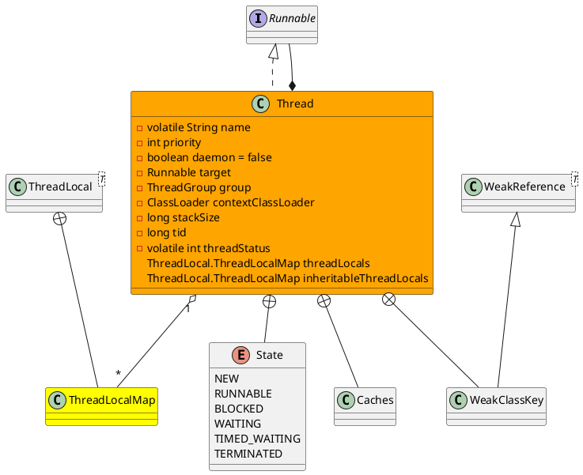
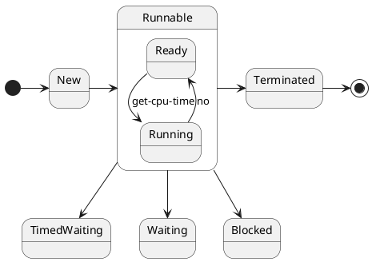

java.lang.Thread

* volatile
* synchronized
* final
* ClassLoader
* WeakReference, priority
* 核心方法
  * join
  * start
  * sleep
* 线程的同步与异步 任务是否在同一个线程执行
* 线程的阻塞与非阻塞 异步执行任务时，线程是不是会**阻塞**等待任务结果，还是执行后面逻辑

## define
* 线程字段
  * 名称
  * 优先级
  * 守护线程
  * 线程组
  * 上下文类加载器
  * 访问控制上下文
  * 线程初始记录
  * 线程本地Map
  * 继承的线程本地Map
  * 栈大小
  * 线程ID tid
  * 线程状态



## thread state
线程状态：新建、可运行（就绪、正在运行）、阻塞、等待、超时等待、终止



## default threads
* "Attach Listener"@839: RUNNING
* "Finalizer"@841: WAIT
* "Reference Handler"@842: WAIT
* "Signal Dispatcher"@840: RUNNING
* "main"@1 in group "main": RUNNING


## jstack
```
Full thread dump Java HotSpot(TM) 64-Bit Server VM (25.181-b13 mixed mode):

"Service Thread" #13 daemon prio=9 os_prio=0 tid=0x0000000020ff1000 nid=0x571c8 runnable [0x0000000000000000]
   java.lang.Thread.State: RUNNABLE

"C1 CompilerThread3" #12 daemon prio=9 os_prio=2 tid=0x0000000020f3f800 nid=0x57150 waiting on condition [0x0000000000000000]
   java.lang.Thread.State: RUNNABLE

"C2 CompilerThread2" #11 daemon prio=9 os_prio=2 tid=0x0000000020f3f000 nid=0x57194 waiting on condition [0x0000000000000000]
   java.lang.Thread.State: RUNNABLE

"C2 CompilerThread1" #10 daemon prio=9 os_prio=2 tid=0x0000000020f21000 nid=0x56ca4 waiting on condition [0x0000000000000000]
   java.lang.Thread.State: RUNNABLE

"C2 CompilerThread0" #9 daemon prio=9 os_prio=2 tid=0x0000000020f20800 nid=0x562fc waiting on condition [0x0000000000000000]
   java.lang.Thread.State: RUNNABLE

"JDWP Command Reader" #8 daemon prio=10 os_prio=0 tid=0x000000001ef71800 nid=0x562f8 runnable [0x0000000000000000]
   java.lang.Thread.State: RUNNABLE

"JDWP Event Helper Thread" #7 daemon prio=10 os_prio=0 tid=0x000000001ef6d000 nid=0x572a0 runnable [0x0000000000000000]
   java.lang.Thread.State: RUNNABLE

"JDWP Transport Listener: dt_socket" #6 daemon prio=10 os_prio=0 tid=0x000000001ef5e800 nid=0x56fd8 runnable [0x0000000000000000]
   java.lang.Thread.State: RUNNABLE

"Attach Listener" #5 daemon prio=5 os_prio=2 tid=0x000000001ef53800 nid=0x57208 waiting on condition [0x0000000000000000]
   java.lang.Thread.State: RUNNABLE

"Signal Dispatcher" #4 daemon prio=9 os_prio=2 tid=0x000000001eef8000 nid=0x56b5c runnable [0x0000000000000000]
   java.lang.Thread.State: RUNNABLE

"Finalizer" #3 daemon prio=8 os_prio=1 tid=0x000000001eed3800 nid=0x57124 in Object.wait() [0x000000002023e000]
   java.lang.Thread.State: WAITING (on object monitor)
	at java.lang.Object.wait(Native Method)
	- waiting on <0x00000006c100a2c8> (a java.lang.ref.ReferenceQueue$Lock)
	at java.lang.ref.ReferenceQueue.remove(ReferenceQueue.java:144)
	- locked <0x00000006c100a2c8> (a java.lang.ref.ReferenceQueue$Lock)
	at java.lang.ref.ReferenceQueue.remove(ReferenceQueue.java:165)
	at java.lang.ref.Finalizer$FinalizerThread.run(Finalizer.java:216)

"Reference Handler" #2 daemon prio=10 os_prio=2 tid=0x000000001d813000 nid=0x56d6c in Object.wait() [0x000000002013f000]
   java.lang.Thread.State: WAITING (on object monitor)
	at java.lang.Object.wait(Native Method)
	- waiting on <0x00000006c100a000> (a java.lang.ref.Reference$Lock)
	at java.lang.Object.wait(Object.java:502)
	at java.lang.ref.Reference.tryHandlePending(Reference.java:191)
	- locked <0x00000006c100a000> (a java.lang.ref.Reference$Lock)
	at java.lang.ref.Reference$ReferenceHandler.run(Reference.java:153)

"main" #1 prio=5 os_prio=0 tid=0x000000000390d800 nid=0x57100 runnable [0x000000000387e000]
   java.lang.Thread.State: RUNNABLE
	at java.io.FileOutputStream.writeBytes(Native Method)
	at java.io.FileOutputStream.write(FileOutputStream.java:326)
	at java.io.BufferedOutputStream.flushBuffer(BufferedOutputStream.java:82)
	at java.io.BufferedOutputStream.flush(BufferedOutputStream.java:140)
	- locked <0x00000006c10331d0> (a java.io.BufferedOutputStream)
	at java.io.PrintStream.write(PrintStream.java:482)
	- locked <0x00000006c1006c80> (a java.io.PrintStream)
	at sun.nio.cs.StreamEncoder.writeBytes(StreamEncoder.java:221)
	at sun.nio.cs.StreamEncoder.implFlushBuffer(StreamEncoder.java:291)
	at sun.nio.cs.StreamEncoder.flushBuffer(StreamEncoder.java:104)
	- locked <0x00000006c1006c40> (a java.io.OutputStreamWriter)
	at java.io.OutputStreamWriter.flushBuffer(OutputStreamWriter.java:185)
	at java.io.PrintStream.newLine(PrintStream.java:546)
	- locked <0x00000006c1006c80> (a java.io.PrintStream)
	at java.io.PrintStream.println(PrintStream.java:737)
	- locked <0x00000006c1006c80> (a java.io.PrintStream)
	at com.onion.test.java.lang.Test.test(Test.java:9)
	at sun.reflect.NativeMethodAccessorImpl.invoke0(Native Method)
	at sun.reflect.NativeMethodAccessorImpl.invoke(NativeMethodAccessorImpl.java:62)
	at sun.reflect.DelegatingMethodAccessorImpl.invoke(DelegatingMethodAccessorImpl.java:43)
	at java.lang.reflect.Method.invoke(Method.java:498)
	at org.junit.runners.model.FrameworkMethod$1.runReflectiveCall(FrameworkMethod.java:50)
	at org.junit.internal.runners.model.ReflectiveCallable.run(ReflectiveCallable.java:12)
	at org.junit.runners.model.FrameworkMethod.invokeExplosively(FrameworkMethod.java:47)
	at org.junit.internal.runners.statements.InvokeMethod.evaluate(InvokeMethod.java:17)
	at org.junit.runners.ParentRunner.runLeaf(ParentRunner.java:325)
	at org.junit.runners.BlockJUnit4ClassRunner.runChild(BlockJUnit4ClassRunner.java:78)
	at org.junit.runners.BlockJUnit4ClassRunner.runChild(BlockJUnit4ClassRunner.java:57)
	at org.junit.runners.ParentRunner$3.run(ParentRunner.java:290)
	at org.junit.runners.ParentRunner$1.schedule(ParentRunner.java:71)
	at org.junit.runners.ParentRunner.runChildren(ParentRunner.java:288)
	at org.junit.runners.ParentRunner.access$000(ParentRunner.java:58)
	at org.junit.runners.ParentRunner$2.evaluate(ParentRunner.java:268)
	at org.junit.runners.ParentRunner.run(ParentRunner.java:363)
	at org.junit.runner.JUnitCore.run(JUnitCore.java:137)
	at com.intellij.junit4.JUnit4IdeaTestRunner.startRunnerWithArgs(JUnit4IdeaTestRunner.java:68)
	at com.intellij.rt.execution.junit.IdeaTestRunner$Repeater.startRunnerWithArgs(IdeaTestRunner.java:47)
	at com.intellij.rt.execution.junit.JUnitStarter.prepareStreamsAndStart(JUnitStarter.java:242)
	at com.intellij.rt.execution.junit.JUnitStarter.main(JUnitStarter.java:70)
"VM Thread" os_prio=2 tid=0x000000001d808800 nid=0x5675c runnable 

"GC task thread#0 (ParallelGC)" os_prio=0 tid=0x0000000003922000 nid=0x56be8 runnable 
"GC task thread#1 (ParallelGC)" os_prio=0 tid=0x0000000003923800 nid=0x233f0 runnable 
"GC task thread#2 (ParallelGC)" os_prio=0 tid=0x0000000003925000 nid=0x57384 runnable 
"GC task thread#3 (ParallelGC)" os_prio=0 tid=0x0000000003926800 nid=0x57388 runnable 
"GC task thread#4 (ParallelGC)" os_prio=0 tid=0x0000000003929800 nid=0x5671c runnable 
"GC task thread#5 (ParallelGC)" os_prio=0 tid=0x000000000392b000 nid=0x50478 runnable 
"GC task thread#6 (ParallelGC)" os_prio=0 tid=0x000000000392e000 nid=0x56720 runnable 
"GC task thread#7 (ParallelGC)" os_prio=0 tid=0x000000000392f000 nid=0x4f8a4 runnable 
"GC task thread#8 (ParallelGC)" os_prio=0 tid=0x0000000003930800 nid=0x57228 runnable 
"GC task thread#9 (ParallelGC)" os_prio=0 tid=0x0000000003931800 nid=0x15a4 runnable 
"VM Periodic Task Thread" os_prio=2 tid=0x00000000210a5800 nid=0x56604 waiting on condition 
JNI global references: 2550
```

