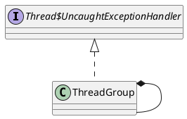

java.lang.ThreadGroup

## define


```java
public
class ThreadGroup implements Thread.UncaughtExceptionHandler {
    private final ThreadGroup parent;
    String name;
    int maxPriority;
    boolean destroyed;
    boolean daemon;
    boolean vmAllowSuspension;

    int nUnstartedThreads = 0;
    int nthreads;
    Thread threads[];

    int ngroups;
    ThreadGroup groups[];

    /**
     * Creates an empty Thread group that is not in any Thread group.
     * This method is used to create the system Thread group.
     */
    private ThreadGroup() {     // called from C code
        this.name = "system";
        this.maxPriority = Thread.MAX_PRIORITY;
        this.parent = null;
    }
}    
```