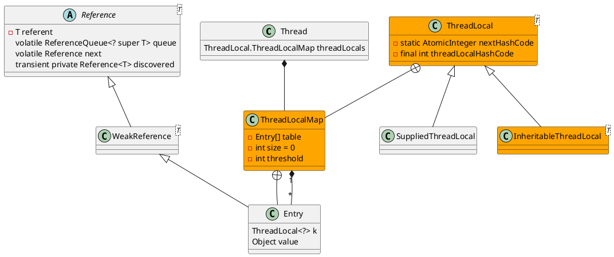

java.lang.ThreadLocal

解决哈希冲突方法
* 开放地址法
  * 线性探测，顺序查看下一个单元，知道找出一个空闲单元或遍历全表；ThreadLocalMap
  * 平方探测
  * 再散列法
  * 伪随机序列法
* 拉链法（链接法）

## pacakge
```
ThreadLocal (java.lang)
    InheritableThreadLocal (java.lang)
    NamedThreadLocal (org.springframework.core)
    ThreadLocalBoolean (org.jboss.netty.util.internal)
```

## define
* AtomicInteger.getAndAdd()
* WeakReference
* final


threadLocal内存泄漏的根源是：由于ThreadLocalMap的生命周期跟Thread一样长，如果没有手动删除对应key就会导致内存泄漏，而不是因为弱引用。

## fields
```java
    private final int threadLocalHashCode = nextHashCode();
    private static AtomicInteger nextHashCode = new AtomicInteger();
    private static final int HASH_INCREMENT = 0x61c88647;
    private static int nextHashCode() {
        return nextHashCode.getAndAdd(HASH_INCREMENT);
    }
```

## methods

### get()
```
    public T get() {
        // 当前线程
        Thread t = Thread.currentThread();
        // 线程本地映射
        ThreadLocalMap map = getMap(t);
        if (map != null) {
            ThreadLocalMap.Entry e = map.getEntry(this);
            if (e != null) {
                @SuppressWarnings("unchecked")
                T result = (T)e.value;
                return result;
            }
        }
        return setInitialValue();
    }
    
    ThreadLocalMap getMap(Thread t) {
        return t.threadLocals;
    }    

    private T setInitialValue() {
        T value = initialValue();
        Thread t = Thread.currentThread();
        ThreadLocalMap map = getMap(t);
        if (map != null)
            map.set(this, value);
        else
            createMap(t, value);
        return value;
    }
```

### set
```java
    public void set(T value) {
        Thread t = Thread.currentThread();
        ThreadLocalMap map = getMap(t);
        if (map != null)
            map.set(this, value);
        else
            createMap(t, value);
    }
```
 
### remove
```java
     public void remove() {
         ThreadLocalMap m = getMap(Thread.currentThread());
         if (m != null)
             m.remove(this);
     }
```


## inner class

### ThreadLocalMap

```java
    static class ThreadLocalMap {
        private static final int INITIAL_CAPACITY = 16;
        private Entry[] table;
        private int size = 0;
        private int threshold; // Default to 0
    }
```

#### ThreadLocalMap
```java
    ThreadLocalMap(ThreadLocal<?> firstKey, Object firstValue) {
            table = new Entry[INITIAL_CAPACITY];
            int i = firstKey.threadLocalHashCode & (INITIAL_CAPACITY - 1);
            table[i] = new Entry(firstKey, firstValue);
            size = 1;
            setThreshold(INITIAL_CAPACITY);
        }        
        
        private ThreadLocalMap(ThreadLocalMap parentMap) {
            Entry[] parentTable = parentMap.table;
            int len = parentTable.length;
            setThreshold(len);
            table = new Entry[len];
    
            for (int j = 0; j < len; j++) {
                Entry e = parentTable[j];
                if (e != null) {
                    @SuppressWarnings("unchecked")
                    ThreadLocal<Object> key = (ThreadLocal<Object>) e.get();
                    if (key != null) {
                        Object value = key.childValue(e.value);
                        Entry c = new Entry(key, value);
                        int h = key.threadLocalHashCode & (len - 1);
                        while (table[h] != null)
                            h = nextIndex(h, len);
                        table[h] = c;
                        size++;
                    }
                }
            }
        }
```

#### getEntry
```java
        private Entry getEntry(ThreadLocal<?> key) {
            int i = key.threadLocalHashCode & (table.length - 1);
            Entry e = table[i];
            if (e != null && e.get() == key)
                return e;
            else
                return getEntryAfterMiss(key, i, e);
        }
```

#### set
```java
        private void set(ThreadLocal<?> key, Object value) {

            // We don't use a fast path as with get() because it is at
            // least as common to use set() to create new entries as
            // it is to replace existing ones, in which case, a fast
            // path would fail more often than not.

            Entry[] tab = table;
            int len = tab.length;
            int i = key.threadLocalHashCode & (len-1);

            for (Entry e = tab[i];
                 e != null;
                 e = tab[i = nextIndex(i, len)]) {
                ThreadLocal<?> k = e.get();

                if (k == key) {
                    e.value = value;
                    return;
                }

                if (k == null) {
                    replaceStaleEntry(key, value, i);
                    return;
                }
            }

            tab[i] = new Entry(key, value);
            int sz = ++size;
            if (!cleanSomeSlots(i, sz) && sz >= threshold)
                rehash();
        }
```
