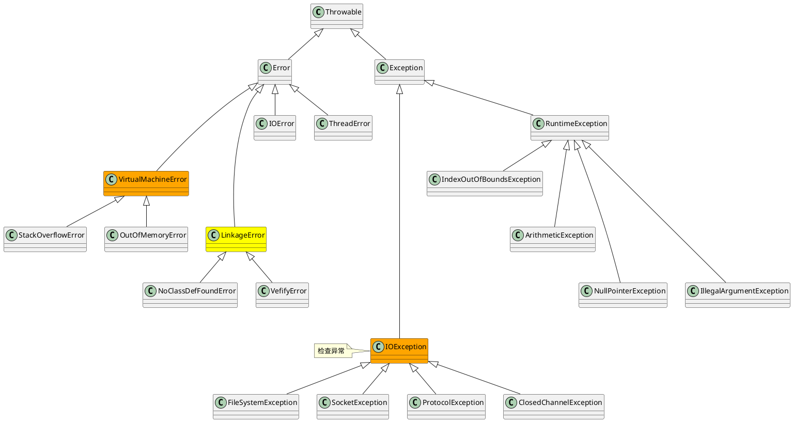

java.lang.Throwable

## hierarchy
```
Throwable (java.lang)
    Error (java.lang)
        VirtualMachineError (java.lang)                         JVM虚拟机错误
            StackOverflowError (java.lang)                          栈溢出
            UnknownError (java.lang)
            InternalError (java.lang)                               JVM内部错误
            OutOfMemoryError (java.lang)                            内存溢出 堆、元空间、直接内存、GC开销、创建本地线程
                OutOfDirectMemoryError (io.netty.util.internal)
        LinkageError (java.lang)                                类加载-连接期错误 加载、连接（验证、准备、解析）、初始化 
            IncompatibleClassChangeError (java.lang)                不相容的类改变错误，不能通过符号引用验证
                IllegalAccessError (java.lang)
                NoSuchFieldError (java.lang)                            字段解析
                NoSuchMethodError (java.lang)                           方法解析
                AbstractMethodError (java.lang)
                InstantiationError (java.lang)
            ClassCircularityError (java.lang)                       类循环依赖错误
            BootstrapMethodError (java.lang)
            ClassFormatError (java.lang)                            验证-类文件格式
            UnsatisfiedLinkError (java.lang)
            NoClassDefFoundError (java.lang)                        无类定义发现错误
            ExceptionInInitializerError (java.lang)
            VerifyError (java.lang)                                 验证错误 验证、准备、解析
        IOError (java.io)
        ThreadDeath (java.lang)
    Exception (java.lang)
        ActivationException (java.rmi.activation)
        ReflectiveOperationException (java.lang)                反射异常
            IllegalAccessException (java.lang)
            NoSuchFieldException (java.lang)
            NoSuchMethodException (java.lang)
            InstantiationException (java.lang)
            ClassNotFoundException (java.lang)                      未发现类异常
            InvocationTargetException (java.lang.reflect)           
        InterruptedException (java.lang)                        线程中断异常
        SQLException (java.sql)                                 SQL异常
            SQLTransientException (java.sql)
            SQLNonTransientException (java.sql)
            BatchUpdateException (java.sql)
            SQLClientInfoException (java.sql)
            SyncProviderException (javax.sql.rowset.spi)
            SerialException (javax.sql.rowset.serial)
        IOException (java.io)                                   IO输入输出异常
            InterruptedIOException (java.io)
            EOFException (java.io)
            CharConversionException (java.io)
            UnsupportedEncodingException (java.io)
            ObjectStreamException (java.io)
            FileSystemException (java.nio.file)                     文件系统异常
            ClosedChannelException (java.nio.channels)
            FileLockInterruptionException (java.nio.channels)
            RemoteException (java.rmi)
            UnknownServiceException (java.net)
            ProtocolException (java.net)                            网络协议异常
            SocketException (java.net)                              套接字异常
                BindException (java.net)                                绑定端口异常
                ConnectException (java.net)                             连接异常
                PortUnreachableException (java.net)
                NoRouteToHostException (java.net)
        RuntimeException (java.lang)                            运行时异常
            IndexOutOfBoundsException (java.lang)
            ArithmeticException (java.lang)
            ClassCastException (java.lang)
            SecurityException (java.lang)
            ArrayStoreException (java.lang)
            ConcurrentModificationException (java.util)             并发修改异常-快速失败策略
            CompletionException (java.util.concurrent)
            DateTimeException (java.time)
            NullPointerException (java.lang)
            IllegalStateException (java.lang)
            IllegalArgumentException (java.lang)
            FileSystemNotFoundException (java.nio.file)
            BufferOverflowException (java.nio)
            BufferUnderflowException (java.nio)
        TimeoutException (java.util.concurrent)
        ParseException (java.text)
        RollbackException (javax.transaction)                   事务回滚异常
        ServletException (javax.servlet)                        

        
```

## define


