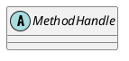

java.lang.invoke.MethodHandleInfo

方法句柄（method handle）是JSR 292中引入的一个重要概念，它是对Java中方法、构造方法和域的一个强类型的可执行的引用。

## hierarchy
```
MethodHandle (java.lang.invoke)
    BoundMethodHandle (java.lang.invoke)
        SimpleMethodHandle (java.lang.invoke)
        Species_L in BoundMethodHandle (java.lang.invoke)
    DelegatingMethodHandle (java.lang.invoke)
        AsVarargsCollector in MethodHandleImpl (java.lang.invoke)
        CountingWrapper in MethodHandleImpl (java.lang.invoke)
        IntrinsicMethodHandle in MethodHandleImpl (java.lang.invoke)
        WrappedMember in MethodHandleImpl (java.lang.invoke)
    DirectMethodHandle (java.lang.invoke)
        Accessor in DirectMethodHandle (java.lang.invoke)
        Constructor in DirectMethodHandle (java.lang.invoke)
        Interface in DirectMethodHandle (java.lang.invoke)
        Special in DirectMethodHandle (java.lang.invoke)
        StaticAccessor in DirectMethodHandle (java.lang.invoke)
```

## define


## fields


## methods