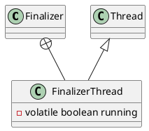

java.lang.ref.Finalizer

* volatile
* synchronized

## hierarchy
```
Reference (java.lang.ref)
    FinalReference (java.lang.ref)
        Finalizer (java.lang.ref)
```
## define


## FinalizerThread 静态代码块启动线程
```java
static {
    ThreadGroup tg = Thread.currentThread().getThreadGroup();
    for (ThreadGroup tgn = tg;
         tgn != null;
         tg = tgn, tgn = tg.getParent());
    Thread finalizer = new FinalizerThread(tg);
    finalizer.setPriority(Thread.MAX_PRIORITY - 2);
    finalizer.setDaemon(true);
    finalizer.start();
}
```