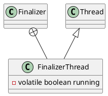

java.lang.ref.Finalizer

* volatile
* synchronized

## hierarchy
```
Reference (java.lang.ref)
    FinalReference (java.lang.ref)
        Finalizer (java.lang.ref)
```
## define


## inner class

### FinalizerThread
```java
    private static class FinalizerThread extends Thread {
        private volatile boolean running;
        FinalizerThread(ThreadGroup g) {
            super(g, "Finalizer");
        }
        public void run() {
            // in case of recursive call to run()
            if (running)
                return;

            // Finalizer thread starts before System.initializeSystemClass
            // is called.  Wait until JavaLangAccess is available
            while (!VM.isBooted()) {
                // delay until VM completes initialization
                try {
                    VM.awaitBooted();
                } catch (InterruptedException x) {
                    // ignore and continue
                }
            }
            final JavaLangAccess jla = SharedSecrets.getJavaLangAccess();
            running = true;
            for (;;) {
                try {
                    Finalizer f = (Finalizer)queue.remove();
                    f.runFinalizer(jla);
                } catch (InterruptedException x) {
                    // ignore and continue
                }
            }
        }
    }
```

### FinalizerThread 静态代码块启动线程
```java
static {
    ThreadGroup tg = Thread.currentThread().getThreadGroup();
    for (ThreadGroup tgn = tg;
         tgn != null;
         tg = tgn, tgn = tg.getParent());
    Thread finalizer = new FinalizerThread(tg);
    finalizer.setPriority(Thread.MAX_PRIORITY - 2);
    finalizer.setDaemon(true);
    finalizer.start();
}
```