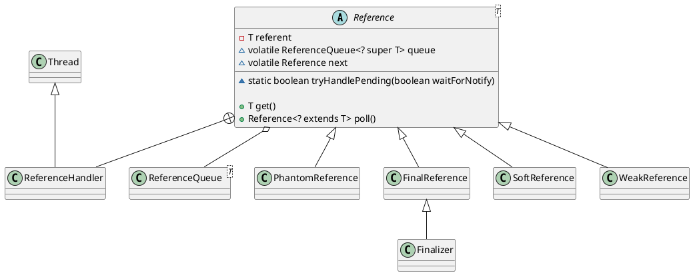

java.lang.ref.Reference

* synchronized
* volatile

## hierarchy
```
Reference (java.lang.ref)
    SoftReference (java.lang.ref)       软引用
    WeakReference (java.lang.ref)       弱引用
    PhantomReference (java.lang.ref)    虚引用
    FinalReference (java.lang.ref)      
        Finalizer (java.lang.ref)
```

## define



### WeakReference与GC
当一个对象仅仅被weak reference指向, 而没有任何其他strong reference指向的时候, 如果GC运行, 那么这个对象就会被回收. weak reference的语法是:

```
// cache
WeakReference<Car> weakCar = new WeakReference(Car)(car);
```

当要获得weak reference引用的object时, 首先需要判断它是否已经被回收:

```
weakCar.get();
```

如果此方法为空, 那么说明weakCar指向的对象已经被回收了.

* WeakReference的一个特点是它何时被回收是不可确定的, 因为这是由GC运行的不确定性所确定的
* SoftReference

soft reference和weak reference一样, 但被GC回收的时候需要多一个条件: 当系统内存不足时(GC是如何判定系统内存不足? 是否有参数可以配置这个threshold?), soft reference指向的object才会被回收. 正因为有这个特性, soft reference比weak reference更加适合做cache objects的reference. 因为它可以尽可能的retain cached objects, 减少重建他们所需的时间和消耗.

## ReferenceHandler 静态代码块启动线程
```java
static {
    ThreadGroup tg = Thread.currentThread().getThreadGroup();
    for (ThreadGroup tgn = tg;
         tgn != null;
         tg = tgn, tgn = tg.getParent());
    Thread handler = new ReferenceHandler(tg, "Reference Handler");
    /* If there were a special system-only priority greater than
     * MAX_PRIORITY, it would be used here
     */
    handler.setPriority(Thread.MAX_PRIORITY);
    handler.setDaemon(true);
    handler.start();

    // provide access in SharedSecrets
    SharedSecrets.setJavaLangRefAccess(new JavaLangRefAccess() {
        @Override
        public boolean tryHandlePendingReference() {
            return tryHandlePending(false);
        }
    });
}
```