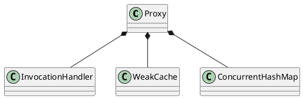

java.lang.reflect.Proxy

## define


```conf
-Dsun.misc.ProxyGenerator.saveGeneratedFiles=true
-Dcglib.debugLocation=C:/var/java/cglib/
System.setProperty(DebuggingClassWriter.DEBUG_LOCATION_PROPERTY, "类文件指定输出目录");
```