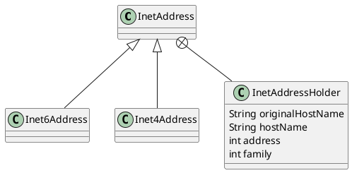

java.net.InetAddress

## hierarchy
```
InetAddress (java.net)
    Inet6Address (java.net)
    Inet4Address (java.net)
```

## define

```plantuml
@startuml

class InetAddress 
class Inet6Address
class Inet4Address

InetAddress ^-- Inet4Address
InetAddress ^-- Inet6Address

InetAddress +-- InetAddressHolder

class InetAddressHolder {
    String originalHostName
    String hostName
    int address
    int family
}

@enduml
```