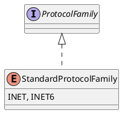

java.net

## package
```
AbstractPlainDatagramSocketImpl
AbstractPlainSocketImpl
Authenticator
BindException
CacheRequest
CacheResponse
ConnectException
ContentHandler
ContentHandlerFactory
CookieHandler
CookieManager
CookiePolicy
CookieStore
DatagramPacket
DatagramSocket
DatagramSocketImpl
DatagramSocketImplFactory
DefaultDatagramSocketImplFactory
DefaultInterface
DualStackPlainDatagramSocketImpl
DualStackPlainSocketImpl
FactoryURLClassLoader
FileNameMap
HostPortrange
HttpConnectSocketImpl
HttpCookie
HttpRetryException
HttpURLConnection
IDN
Inet4Address
Inet4AddressImpl
Inet6Address
Inet6AddressImpl
InetAddress
InetAddressContainer
InetAddressImpl
InetAddressImplFactory
InetSocketAddress
InMemoryCookieStore
InterfaceAddress
JarURLConnection
MalformedURLException
MulticastSocket
NetPermission
NetworkInterface
NoRouteToHostException
Parts
PasswordAuthentication
PlainSocketImpl
PortUnreachableException
ProtocolException
ProtocolFamily
Proxy
ProxySelector
ResponseCache
SdpSocketImpl
SecureCacheResponse
ServerSocket
Socket
SocketAddress
SocketException
SocketImpl
SocketImplFactory
SocketInputStream
SocketOption
SocketOptions
SocketOutputStream
SocketPermission
SocketPermissionCollection
SocketSecrets
SocketTimeoutException
SocksConsts
SocksSocketImpl
StandardProtocolFamily
StandardSocketOptions
TwoStacksPlainDatagramSocketImpl
TwoStacksPlainSocketImpl
UnknownContentHandler
UnknownHostException
UnknownServiceException
URI
URISyntaxException
URL
URLClassLoader
URLConnection
URLDecoder
UrlDeserializedState
URLEncoder
URLPermission
URLStreamHandler
URLStreamHandlerFactory
```

## overview


## 网络分层

### 物理层

### 数据链路层

### 网络层
```
// ip
InetAddress
Inet4Address
Inet6Address
InterfaceAddress

ProtocolException
ProtocolFamily
StandardProtocolFamily
```

### 传输层
```
// tcp
ServerSocket
Socket
SocketAddress
SocketException
SocketImpl
SocketImplFactory
SocketInputStream
SocketOption
SocketOptions
SocketOutputStream
SocketPermission
SocketPermissionCollection
SocketSecrets
SocketTimeoutException
SocksConsts
SocksSocketImpl

BindException
ConnectException

StandardSocketOptions

// udp
DatagramPacket
DatagramSocket
DatagramSocketImpl
DatagramSocketImplFactory

AbstractPlainDatagramSocketImpl
AbstractPlainSocketImpl
```

### 应用层
```
// http, html
HttpConnectSocketImpl
HttpRetryException
HttpURLConnection
ContentHandler
ContentHandlerFactory

// http 无状态的解决
CookieHandler
CookieManager
CookiePolicy
CookieStore
HttpCookie

// uri, url
URI
URISyntaxException
URL
URLClassLoader
URLConnection
URLDecoder
UrlDeserializedState
URLEncoder
URLPermission
URLStreamHandler
URLStreamHandlerFactory
```

### 安全
```
NetPermission
PasswordAuthentication
Authenticator
```