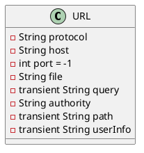

java.net.URL

## define

```plantuml
@startuml

class URL {
    - String protocol
    - String host
    - int port = -1
    - String file
    - transient String query
    - String authority
    - transient String path
    - transient String userInfo
}

@enduml
```