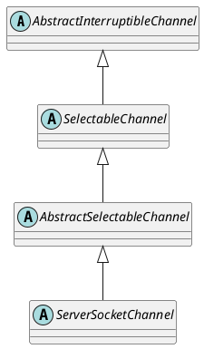

java.nio.channels.ServerSocketChannel

## hierarchy
```
AbstractInterruptibleChannel (java.nio.channels.spi)
    SelectableChannel (java.nio.channels)
        AbstractSelectableChannel (java.nio.channels.spi)
            ServerSocketChannel (java.nio.channels)
                ServerSocketChannelImpl (sun.nio.ch)
ServerSocketChannel (java.nio.channels)
    AbstractSelectableChannel (java.nio.channels.spi)
        SelectableChannel (java.nio.channels)
            AbstractInterruptibleChannel (java.nio.channels.spi)
                Channel (java.nio.channels)
                InterruptibleChannel (java.nio.channels)
                    Channel (java.nio.channels)
            Channel (java.nio.channels)
    NetworkChannel (java.nio.channels)
        Channel (java.nio.channels)
```
## define
