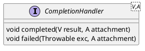

java.nio.channels.CompletionHandler

## pacakge
```
CompletionHandler (java.nio.channels)
    CompletionHandlerWrapper (jdk.management.resource.internal)
    // tomcat
    1 in SecureNio2Channel (org.apache.tomcat.util.net)
    6 in Nio2SocketWrapper in Nio2Endpoint (org.apache.tomcat.util.net)
    GatherWriteCompletionHandler in Nio2SocketWrapper in Nio2Endpoint (org.apache.tomcat.util.net)
    HandshakeReadCompletionHandler in SecureNio2Channel (org.apache.tomcat.util.net)
    HandshakeWriteCompletionHandler in SecureNio2Channel (org.apache.tomcat.util.net)
    WsFrameClientCompletionHandler in WsFrameClient (org.apache.tomcat.websocket)
    ScatterReadCompletionHandler in Nio2SocketWrapper in Nio2Endpoint (org.apache.tomcat.util.net)
    // spring
    AsynchronousFileChannelReadCompletionHandler in DataBufferUtils (org.springframework.core.io.buffer)
    AsynchronousFileChannelWriteCompletionHandler in DataBufferUtils (org.springframework.core.io.buffer)
    ReadHandler (cn.hutool.socket.aio)
    AcceptHandler (cn.hutool.socket.aio)
```

## define


## 异步、事件驱动
* 异步Future 线程池配合Future实现，但是会阻塞主请求线程，高并发时依然会造成线程数过多、CPU上下文切换。
* 异步Callback 回调函数，CompletionHandler，FutureCallback。
* 异步编排CompletableFuture