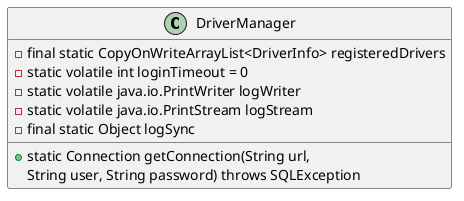

java.sql.DriverManager

## define

```plantuml
@startuml

class DriverManager {
    - final static CopyOnWriteArrayList<DriverInfo> registeredDrivers
    - static volatile int loginTimeout = 0
    - static volatile java.io.PrintWriter logWriter
    - static volatile java.io.PrintStream logStream
    - final static Object logSync
    + static Connection getConnection(String url,
        String user, String password) throws SQLException
}

@enduml
```
