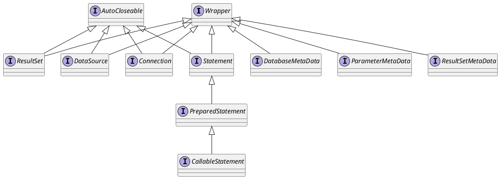

java.sql
## package
```
Array
BatchUpdateException
Blob
CallableStatement
ClientInfoStatus
Clob
Connection
DatabaseMetaData
DataTruncation
Date
Driver
DriverAction
DriverInfo
DriverManager
DriverPropertyInfo
JDBCType
NClob
ParameterMetaData
PreparedStatement
PseudoColumnUsage
Ref
ResultSet
ResultSetMetaData
RowId
RowIdLifetime
Savepoint
SQLClientInfoException
SQLData
SQLDataException
SQLException
SQLFeatureNotSupportedException
SQLInput
SQLIntegrityConstraintViolationException
SQLInvalidAuthorizationSpecException
SQLNonTransientConnectionException
SQLNonTransientException
SQLOutput
SQLPermission
SQLRecoverableException
SQLSyntaxErrorException
SQLTimeoutException
SQLTransactionRollbackException
SQLTransientConnectionException
SQLTransientException
SQLType
SQLWarning
SQLXML
Statement
Struct
Time
Timestamp
Types
Wrapper
```

## overview


## framework
- mybatis
- mysql
- sharding-jdbc