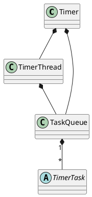

java.util.Timer

Timer 的优点在于简单易用，但由于所有任务都是由同一个线程来调度，因此所有任务都是串行执行的，同一时间只能有一个任务在执行，前一个任务的延迟或异常都将会影响到之后的任务。
## define



```java
public class Timer {
    private final TaskQueue queue = new TaskQueue();
    private final TimerThread thread = new TimerThread(queue);
    
    public Timer(String name, boolean isDaemon) {
        thread.setName(name);
        thread.setDaemon(isDaemon);
        thread.start();
    }
}    
```

## methods

### sched
```java
    private void sched(TimerTask task, long time, long period) {
        if (time < 0)
            throw new IllegalArgumentException("Illegal execution time.");

        // Constrain value of period sufficiently to prevent numeric
        // overflow while still being effectively infinitely large.
        if (Math.abs(period) > (Long.MAX_VALUE >> 1))
            period >>= 1;

        synchronized(queue) {
            if (!thread.newTasksMayBeScheduled)
                throw new IllegalStateException("Timer already cancelled.");

            synchronized(task.lock) {
                if (task.state != TimerTask.VIRGIN)
                    throw new IllegalStateException(
                        "Task already scheduled or cancelled");
                task.nextExecutionTime = time;
                task.period = period;
                task.state = TimerTask.SCHEDULED;
            }

            queue.add(task);
            if (queue.getMin() == task)
                queue.notify();
        }
    }
```