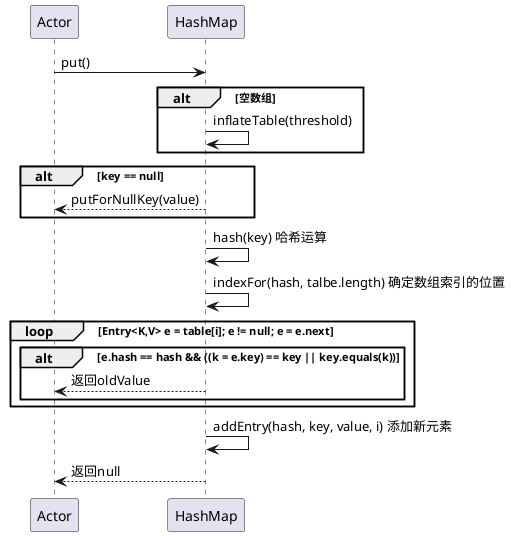
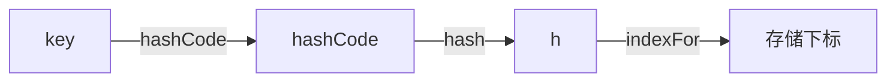
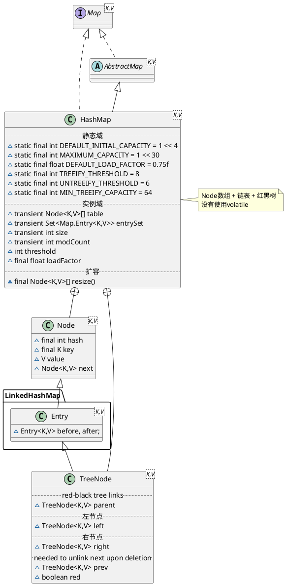

HashMap
* jdk7 Entry数组 + 链表；没有使用volatile
* jdk8 Node数组 + 链表 + 红黑树；没有使用volatile

# 1. jdk7 HashMap


## 1.1 hierarchy
```
AbstractMap (java.util)
    HashMap (java.util)
    LinkedHashMap (java.util)
```
线程不安全、并发修改快速失败

## 1.2 define
* 静态域
* 实例域
  * Entry<K, V>[] table
  * capacity：当前数组容量，始终保持 2^n，可以扩容，扩容后数组大小为当前的 2 倍。
  * loadFactor：负载因子，默认为 0.75。
  * threshold：扩容的阈值，等于 capacity * loadFactor
* 内部类
  * Holder
  * Entry
  * HashIterator
  * ValueIterator
  * KeyIterator
  * EntryIterator
  * KeySet
  * Values
  * EntrySet

```plantuml
@startuml

''''''''''''''''''''''''' Map ''''''''''''''''''''''''''''''
interface Map<K,V>
abstract class AbstractMap<K,V> 
Map ^.. AbstractMap

''''''''''''''''''''''''' HashMap ''''''''''''''''''''''''''''''
class HashMap<K,V> {
    .. 静态域 ..
    static final int DEFAULT_INITIAL_CAPACITY = 1 << 4
    static final int MAXIMUM_CAPACITY = 1 << 30
    static final float DEFAULT_LOAD_FACTOR = 0.75f
    .. 实例域 ..
    static final Entry<?,?>[] EMPTY_TABLE = {};
    transient Entry<K,V>[] table = (Entry<K,V>[]) EMPTY_TABLE;
    transient int size;
    transient int modCount
    int threshold
    final float loadFactor
    ransient int hashSeed = 0
    .. 数组填充（为table分配实际内存空间） ..
    - void inflateTable(int toSize) 
    final boolean initHashSeedAsNeeded(int capacity)
    .. 哈希函数 ..
    final int hash(Object k)
}

note right
Entry数组 + 链表
没有使用volatile
end note

Map ^.. HashMap
AbstractMap ^-- HashMap

''''''''''''''''''''''''' Entry ''''''''''''''''''''''''''''''
interface Map.Entry<K,V> 
Map.Entry ^.. Entry
class Entry<K,V> {
    final K key
    V value
    Entry<K,V> next
    int hash
}

HashMap +-- Entry

@enduml
```

## 1.3 methods

### put

key --> hashCode --> h --> index

1. 如果数组为空数组，则数组初始化
2. key为null的情况特殊处理，置于table[0]
3. 确定数组索引位置。根据key计算hash值，找到相应的数组下标：hash & (length – 1) 位运算
4. 如果数组位置存在元素，则替换，并返回老值
5. 添加节点到链表中
  * 容量大于阈值，需要rehash()，重新哈希计算数组索引位置
  * 创建新Entry，置于数组索引位置，压入单向链表，数量自增


```java
    public V put(K key, V value) {
        //如果table数组为空数组{}，进行数组填充（为table分配实际内存空间），入参为threshold，此时threshold为initialCapacity 默认是1<<4(24=16)
        if (table == EMPTY_TABLE) {
            inflateTable(threshold);
        }
       //如果key为null，存储位置为table[0]或table[0]的冲突链上
        if (key == null)
            return putForNullKey(value);
        int hash = hash(key);//对key的hashcode进一步计算，确保散列均匀
        int i = indexFor(hash, table.length);//获取在table中的实际位置
        for (Entry<K,V> e = table[i]; e != null; e = e.next) {
        //如果该对应数据已存在，执行覆盖操作。用新value替换旧value，并返回旧value
            Object k;
            if (e.hash == hash && ((k = e.key) == key || key.equals(k))) {
                V oldValue = e.value;
                e.value = value;
                e.recordAccess(this);
                return oldValue;
            }
        }
        modCount++;//保证并发访问时，若HashMap内部结构发生变化，快速响应失败
        addEntry(hash, key, value, i);//新增一个entry
        return null;
    }
    
    private void inflateTable(int toSize) {
        int capacity = roundUpToPowerOf2(toSize);//capacity一定是2的次幂
        threshold = (int) Math.min(capacity * loadFactor, MAXIMUM_CAPACITY + 1);//此处为threshold赋值，取capacity*loadFactor和MAXIMUM_CAPACITY+1的最小值，capaticy一定不会超过MAXIMUM_CAPACITY，除非loadFactor大于1
        table = new Entry[capacity];
        initHashSeedAsNeeded(capacity);
    }
    
    private static int roundUpToPowerOf2(int number) {
        // assert number >= 0 : "number must be non-negative";
        return number >= MAXIMUM_CAPACITY
                ? MAXIMUM_CAPACITY
                : (number > 1) ? Integer.highestOneBit((number - 1) << 1) : 1; // Integer.highestOneBit是用来获取最左边的bit（其他bit位为0）所代表的数值.
    }
    
    final int hash(Object k) {
        int h = hashSeed;
        if (0 != h && k instanceof String) {
            return sun.misc.Hashing.stringHash32((String) k);
        }

        h ^= k.hashCode();

        h ^= (h >>> 20) ^ (h >>> 12);
        return h ^ (h >>> 7) ^ (h >>> 4);
    }
    
    static int indexFor(int h, int length) {
        return h & (length-1); // length -1 二进制位全是1， 与运算，相同的位为1
    }
    
    void addEntry(int hash, K key, V value, int bucketIndex) {
        if ((size >= threshold) && (null != table[bucketIndex])) {
            resize(2 * table.length);//当size超过临界阈值threshold，并且即将发生哈希冲突时进行扩容
            hash = (null != key) ? hash(key) : 0;
            bucketIndex = indexFor(hash, table.length);
        }

        createEntry(hash, key, value, bucketIndex);
    }
```

#### put()时序


#### 数组初始化
在第一个元素插入 HashMap 的时候做一次数组的初始化，就是先确定初始的数组大小，并计算数组扩容的阈值。
#### 数组下标确定流程
* key计算hashCode
* hashCode再哈希 位运算
* 确定数组索引 位运算


#### 添加节点到链表中
找到数组下标后，会先进行 key 判重，如果没有重复，就准备将新值放入到链表的**表头**。

#### 数组扩容 
前面我们看到，在插入新值的时候，如果当前的 size 已经达到了阈值，并且要插入的数组位置上已经有元素，那么就会触发扩容，扩容后，数组大小为原来的 2 倍。

PS:resize是HashMap，rehash是ConcurrentHashMap

### get
1. key为null特殊处理
2. 确定数组索引位置；找到相应的数组下标：hash & (length - 1)
3. 遍历该数组位置处的链表，返回哈希值相等或者key equals（==或equals）的元素

```java
    public V get(Object key) {
　　　　 //如果key为null,则直接去table[0]处去检索即可。
        if (key == null)
            return getForNullKey();
        Entry<K,V> entry = getEntry(key);
        return null == entry ? null : entry.getValue();
    }
    
    final Entry<K,V> getEntry(Object key) {
        if (size == 0) {
            return null;
        }
        //通过key的hashcode值计算hash值
        int hash = (key == null) ? 0 : hash(key);
        //indexFor (hash&length-1) 获取最终数组索引，然后遍历链表，通过equals方法比对找出对应记录
        for (Entry<K,V> e = table[indexFor(hash, table.length)];
             e != null;
             e = e.next) {
            Object k;
            if (e.hash == hash && 
                ((k = e.key) == key || (key != null && key.equals(k)))) // 重写equals的方法的时候，注意重写hashCode方法。否则可能出现hashCode相同，但不是同一个对象。
                return e;
        }
        return null;
    }
```


### remove
1. key为null特殊处理
2. 确定数组索引位置
3. 遍历链表，当哈希值相等或者key equals的时候，将此元素离开链表
  * 如果存在前趋，将前趋的next指向次元素的后继
  * 如果不存在前趋，将此元素的后继置于数组索引位置

### size

### resize
```java
    void resize(int newCapacity) {
        Entry[] oldTable = table;
        int oldCapacity = oldTable.length;
        if (oldCapacity == MAXIMUM_CAPACITY) {
            threshold = Integer.MAX_VALUE;
            return;
        }

        Entry[] newTable = new Entry[newCapacity];
        transfer(newTable, initHashSeedAsNeeded(newCapacity));
        table = newTable;
        threshold = (int)Math.min(newCapacity * loadFactor, MAXIMUM_CAPACITY + 1);
    }
    
    void transfer(Entry[] newTable, boolean rehash) {
        int newCapacity = newTable.length;
　　　　　//for循环中的代码，逐个遍历链表，重新计算索引位置，将老数组数据复制到新数组中去（数组不存储实际数据，所以仅仅是拷贝引用而已）
        for (Entry<K,V> e : table) {
            while(null != e) {
                Entry<K,V> next = e.next;
                if (rehash) {
                    e.hash = null == e.key ? 0 : hash(e.key);
                }
                int i = indexFor(e.hash, newCapacity);
　　　　　　　　　 //将当前entry的next链指向新的索引位置,newTable[i]有可能为空，有可能也是个entry链，如果是entry链，直接在链表头部插入。
                e.next = newTable[i];
                newTable[i] = e;
                e = next;
            }
        }
    }
    
```


# 2. jdk8 HashMap


## 2.1 define
* 静态域
  * TREEIFY_THRESHOLD = 8
  * UNTREEIFY_THRESHOLD = 6
  * MIN_TREEIFY_CAPACITY = 64
* 实例域
  * Node<K,V>[] table
  * Set<Map.Entry<K,V>> entrySet
  * size
  * modCount
  * threshold
  * loadFactor
* 内部类
  * Node
  * KeySet
  * Values
  * EntrySet
  * HashIterator
  * KeyIterator
  * ValueIterator
  * EntryIterator
  * HashMapSpliterator
  * KeySpliterator
  * ValueSpliterator
  * EntrySpliterator
  * TreeNode



## links
[Java7/8 中的 HashMap 和 ConcurrentHashMap 全解析](http://www.importnew.com/28263.html)


