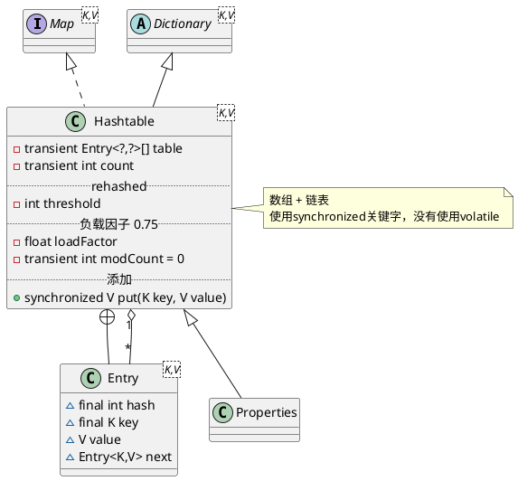

# Hashtable

## hierarchy
```
Dictionary (java.util)
    Hashtable (java.util)
        Properties (java.util)
```

## define
* 静态域
* 对象域
  * 数组 Entry<K,V>[] table
  * count
* 内部类
  * Holder
  * KeySet
  * EntrySet
  * ValueCollection
  * Entry
  * Enumerator



## fields
```java
public class Hashtable<K,V>
    extends Dictionary<K,V>
    implements Map<K,V>, Cloneable, java.io.Serializable {

    private transient Entry<?,?>[] table;
    private transient int count;
    private int threshold;
    private float loadFactor;
    private transient int modCount = 0;
    
    private static final int MAX_ARRAY_SIZE = Integer.MAX_VALUE - 8;
}
```

## methods

### Hashtable
```java
    public Hashtable(int initialCapacity, float loadFactor) {
        if (initialCapacity < 0)
            throw new IllegalArgumentException("Illegal Capacity: "+
                                               initialCapacity);
        if (loadFactor <= 0 || Float.isNaN(loadFactor))
            throw new IllegalArgumentException("Illegal Load: "+loadFactor);

        if (initialCapacity==0)
            initialCapacity = 1;
        this.loadFactor = loadFactor;
        table = new Entry<?,?>[initialCapacity];
        threshold = (int)Math.min(initialCapacity * loadFactor, MAX_ARRAY_SIZE + 1);
    }
    
    public Hashtable(int initialCapacity) {
        this(initialCapacity, 0.75f);
    }

    public Hashtable() {
        this(11, 0.75f);
    }

    public Hashtable(Map<? extends K, ? extends V> t) {
        this(Math.max(2*t.size(), 11), 0.75f);
        putAll(t);
    }
```

### synchronized put()
1. value为null抛异常
2. 确定数组索引位置 hash = hash(key), index = (hash & 0x7FFFFFFF) % tab.length 取模运算
3. 如果数组位置存在元素，则替换，并返回老值
4. 不存在，容量大于阈值，需要rehash()，重新哈希计算数组索引位置
5. 创建新Entry，置于数组索引位置，压入单向链表，数量自增

```java
    public synchronized V put(K key, V value) {
        // Make sure the value is not null
        if (value == null) {
            throw new NullPointerException();
        }

        // Makes sure the key is not already in the hashtable.
        Entry<?,?> tab[] = table;
        int hash = key.hashCode();
        int index = (hash & 0x7FFFFFFF) % tab.length;
        @SuppressWarnings("unchecked")
        Entry<K,V> entry = (Entry<K,V>)tab[index];
        for(; entry != null ; entry = entry.next) {
            if ((entry.hash == hash) && entry.key.equals(key)) {
                V old = entry.value;
                entry.value = value;
                return old;
            }
        }

        addEntry(hash, key, value, index);
        return null;
    }
```
### addEntry
```java
    private void addEntry(int hash, K key, V value, int index) {
        modCount++;

        Entry<?,?> tab[] = table;
        if (count >= threshold) {
            // Rehash the table if the threshold is exceeded
            rehash();

            tab = table;
            hash = key.hashCode();
            index = (hash & 0x7FFFFFFF) % tab.length;
        }

        // Creates the new entry.
        @SuppressWarnings("unchecked")
        Entry<K,V> e = (Entry<K,V>) tab[index];
        tab[index] = new Entry<>(hash, key, value, e);
        count++;
    }   
```

### rehash
```java
    protected void rehash() {
        int oldCapacity = table.length;
        Entry<?,?>[] oldMap = table;

        // overflow-conscious code
        int newCapacity = (oldCapacity << 1) + 1;
        if (newCapacity - MAX_ARRAY_SIZE > 0) {
            if (oldCapacity == MAX_ARRAY_SIZE)
                // Keep running with MAX_ARRAY_SIZE buckets
                return;
            newCapacity = MAX_ARRAY_SIZE;
        }
        Entry<?,?>[] newMap = new Entry<?,?>[newCapacity];

        modCount++;
        threshold = (int)Math.min(newCapacity * loadFactor, MAX_ARRAY_SIZE + 1);
        table = newMap;

        for (int i = oldCapacity ; i-- > 0 ;) {
            for (Entry<K,V> old = (Entry<K,V>)oldMap[i] ; old != null ; ) {
                Entry<K,V> e = old;
                old = old.next;

                int index = (e.hash & 0x7FFFFFFF) % newCapacity;
                e.next = (Entry<K,V>)newMap[index];
                newMap[index] = e;
            }
        }
    }
```

### synchronized get()
1. 确定数组索引位置
2. 遍历该数组位置处的链表，返回哈希值相等或者key equals（==或equals）的元素

```java
    public synchronized V get(Object key) {
        Entry<?,?> tab[] = table;
        int hash = key.hashCode();
        int index = (hash & 0x7FFFFFFF) % tab.length;
        for (Entry<?,?> e = tab[index] ; e != null ; e = e.next) {
            if ((e.hash == hash) && e.key.equals(key)) {
                return (V)e.value;
            }
        }
        return null;
    }
```

### synchronized remove()
1. 确定数组索引位置
2. 遍历链表，当哈希值相等或者key equals的时候，将此元素离开链表
  * 如果存在前趋，将前趋的next指向次元素的后继
  * 如果不存在前趋，将此元素的后继置于数组索引位置

```java
    public synchronized V remove(Object key) {
        Entry<?,?> tab[] = table;
        int hash = key.hashCode();
        int index = (hash & 0x7FFFFFFF) % tab.length;
        @SuppressWarnings("unchecked")
        Entry<K,V> e = (Entry<K,V>)tab[index];
        for(Entry<K,V> prev = null ; e != null ; prev = e, e = e.next) {
            if ((e.hash == hash) && e.key.equals(key)) {
                modCount++;
                if (prev != null) {
                    prev.next = e.next;
                } else {
                    tab[index] = e.next;
                }
                count--;
                V oldValue = e.value;
                e.value = null;
                return oldValue;
            }
        }
        return null;
    }
```

### contains
```java
    public synchronized boolean contains(Object value) {
        if (value == null) {
            throw new NullPointerException();
        }

        Entry<?,?> tab[] = table;
        for (int i = tab.length ; i-- > 0 ;) {
            for (Entry<?,?> e = tab[i] ; e != null ; e = e.next) {
                if (e.value.equals(value)) {
                    return true;
                }
            }
        }
        return false;
    }
```  

### clear
```java
    public synchronized void clear() {
        Entry<?,?> tab[] = table;
        modCount++;
        for (int index = tab.length; --index >= 0; )
            tab[index] = null;
        count = 0;
    }
```

## inner class

### Entry
```java
    private static class Entry<K,V> implements Map.Entry<K,V> {
        final int hash;
        final K key;
        V value;
        Entry<K,V> next;
        protected Entry(int hash, K key, V value, Entry<K,V> next) {
            this.hash = hash;
            this.key =  key;
            this.value = value;
            this.next = next;
        }
    }
```