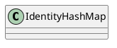

java.util.IdentityHashMap

## hierarchy
```
AbstractMap (java.util)
    IdentityHashMap (java.util)
```

## define


```java
public class IdentityHashMap<K,V> extends AbstractMap<K,V> implements Map<K,V>, java.io.Serializable, Cloneable{
    
    private static final int DEFAULT_CAPACITY = 32;
    private static final int MINIMUM_CAPACITY = 4;
    private static final int MAXIMUM_CAPACITY = 1 << 29;

    transient Object[] table; // non-private to simplify nested class access
    int size;
    transient int modCount;
    static final Object NULL_KEY = new Object();
}
```

## methods

### IdentityHashMap
```java
    public IdentityHashMap() {
        init(DEFAULT_CAPACITY);
    }

    public IdentityHashMap(int expectedMaxSize) {
        if (expectedMaxSize < 0)
            throw new IllegalArgumentException("expectedMaxSize is negative: "
                                               + expectedMaxSize);
        init(capacity(expectedMaxSize));
    }
    
    private void init(int initCapacity) {
        // assert (initCapacity & -initCapacity) == initCapacity; // power of 2
        // assert initCapacity >= MINIMUM_CAPACITY;
        // assert initCapacity <= MAXIMUM_CAPACITY;

        table = new Object[2 * initCapacity];
    }
    
    public IdentityHashMap(Map<? extends K, ? extends V> m) {
        // Allow for a bit of growth
        this((int) ((1 + m.size()) * 1.1));
        putAll(m);
    }
```

### hash
```java
    private static int hash(Object x, int length) {
        int h = System.identityHashCode(x);
        // Multiply by -127, and left-shift to use least bit as part of hash
        return ((h << 1) - (h << 8)) & (length - 1);
    }
```

### get
```java
    public V get(Object key) {
        Object k = maskNull(key);
        Object[] tab = table;
        int len = tab.length;
        int i = hash(k, len);
        while (true) {
            Object item = tab[i];
            if (item == k)
                return (V) tab[i + 1];
            if (item == null)
                return null;
            i = nextKeyIndex(i, len);
        }
    }
```

### put
```java
    public V put(K key, V value) {
        final Object k = maskNull(key);

        retryAfterResize: for (;;) {
            final Object[] tab = table;
            final int len = tab.length;
            int i = hash(k, len);

            for (Object item; (item = tab[i]) != null;
                 i = nextKeyIndex(i, len)) {
                if (item == k) {
                    @SuppressWarnings("unchecked")
                        V oldValue = (V) tab[i + 1];
                    tab[i + 1] = value;
                    return oldValue;
                }
            }

            final int s = size + 1;
            // Use optimized form of 3 * s.
            // Next capacity is len, 2 * current capacity.
            if (s + (s << 1) > len && resize(len))
                continue retryAfterResize;

            modCount++;
            tab[i] = k;
            tab[i + 1] = value;
            size = s;
            return null;
        }
    }
```

### nextKeyIndex
```java
    private static int nextKeyIndex(int i, int len) {
        return (i + 2 < len ? i + 2 : 0);
    }
```

### resize
```java
    private boolean resize(int newCapacity) {
        // assert (newCapacity & -newCapacity) == newCapacity; // power of 2
        int newLength = newCapacity * 2;

        Object[] oldTable = table;
        int oldLength = oldTable.length;
        if (oldLength == 2 * MAXIMUM_CAPACITY) { // can't expand any further
            if (size == MAXIMUM_CAPACITY - 1)
                throw new IllegalStateException("Capacity exhausted.");
            return false;
        }
        if (oldLength >= newLength)
            return false;

        Object[] newTable = new Object[newLength];

        for (int j = 0; j < oldLength; j += 2) {
            Object key = oldTable[j];
            if (key != null) {
                Object value = oldTable[j+1];
                oldTable[j] = null;
                oldTable[j+1] = null;
                int i = hash(key, newLength);
                while (newTable[i] != null)
                    i = nextKeyIndex(i, newLength);
                newTable[i] = key;
                newTable[i + 1] = value;
            }
        }
        table = newTable;
        return true;
    }
```