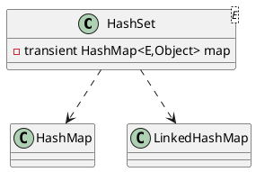

java.util.HashSet

* HashMap<E,Object> 
* LinkedHashMap

## hierarchy
```
AbstractCollection (java.util)
    AbstractSet (java.util)
        HashSet (java.util)
HashSet (java.util)
    AbstractSet (java.util)
        AbstractCollection (java.util)
            Set (java.util)
    Set (java.util)
    Cloneable (java.lang)
    Serializable (java.io)
```

## class
