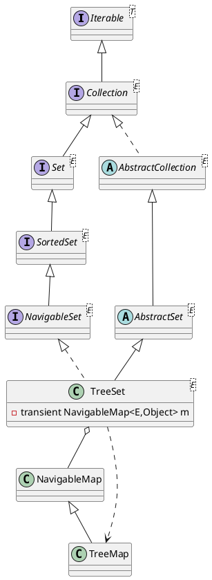

## hierarchy
```
AbstractCollection (java.util)
    AbstractSet (java.util)
        TreeSet (java.util)
```

## define

```plantuml
@startuml

interface Iterable<T>
interface Collection<E>
interface Set<E>
interface SortedSet<E>
interface NavigableSet<E>

Iterable ^-- Collection
Collection ^-- Set
Set ^-- SortedSet
SortedSet ^-- NavigableSet
NavigableSet ^.. TreeSet

abstract class AbstractCollection<E>
abstract class AbstractSet<E>

AbstractCollection ^-- AbstractSet
Collection ^.. AbstractCollection
AbstractSet ^-- TreeSet

class TreeSet<E> {
    - transient NavigableMap<E,Object> m
}

TreeSet o-- NavigableMap
NavigableMap ^-- TreeMap

TreeSet ..> TreeMap

@enduml
```