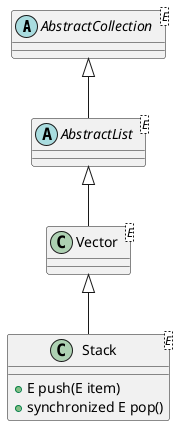

java.util.Stack

## hierarchy
```
AbstractCollection (java.util)
    AbstractList (java.util)
        Vector (java.util)
            Stack (java.util)
Stack (java.util)
    Vector (java.util)
        AbstractList (java.util)
        List (java.util)
        RandomAccess (java.util)
        Cloneable (java.lang)
        Serializable (java.io)
```

## define


## methods

### push
```java
public E push(E item) {
    addElement(item);

    return item;
}
```

### pop
```java
public synchronized E pop() {
    E       obj;
    int     len = size();

    obj = peek();
    removeElementAt(len - 1);

    return obj;
}
```

### peek
```java
public synchronized E peek() {
    int     len = size();

    if (len == 0)
        throw new EmptyStackException();
    return elementAt(len - 1);
}
```