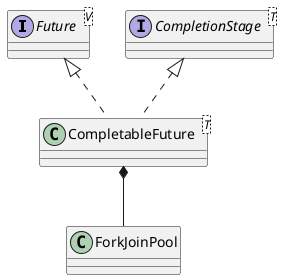

java.util.concurrent.CompletableFuture

* Unsafe
- runAsync Runnable 接口的 run() 方法没有返回值
- supplyAsync Supplier 接口的 get() 方法是有返回值

## hierarchy
```
CompletableFuture (java.util.concurrent)
    Completable in Callback (org.eclipse.jetty.util)
    Completable in Promise (org.eclipse.jetty.util)
    DelegatingCompletableFuture (org.springframework.util.concurrent)
    ServiceFuture (com.microsoft.rest.v2)
CompletableFuture (java.util.concurrent)
    CompletionStage (java.util.concurrent)
    Future (java.util.concurrent)
    Object (java.lang)
```

## define


```java
public class CompletableFuture<T> implements Future<T>, CompletionStage<T> {
    private static final Executor asyncPool = useCommonPool ?
        ForkJoinPool.commonPool() : new ThreadPerTaskExecutor();   
    
    // Modes for Completion.tryFire. Signedness matters.
    static final int SYNC   =  0;
    static final int ASYNC  =  1;
    static final int NESTED = -1;
}
```

## methods
- runAsync(Runnable runnable) Runnable接口的run()方法没有返回值
- supplyAsync(Supplier<U> supplier) Supplier接口的get()方法是有返回值

### runAsync
Runnable 接口的 run() 方法没有返回值
```java
    public static CompletableFuture<Void> runAsync(Runnable runnable) {
        return asyncRunStage(asyncPool, runnable);
    }
    public static CompletableFuture<Void> runAsync(Runnable runnable, Executor executor) {
        return asyncRunStage(screenExecutor(executor), runnable);
    } 
```

### supplyAsync
Supplier 接口的 get() 方法是有返回值
```java
    public static <U> CompletableFuture<U> supplyAsync(Supplier<U> supplier) {
        return asyncSupplyStage(asyncPool, supplier);
    }
    public static <U> CompletableFuture<U> supplyAsync(Supplier<U> supplier, Executor executor) {
        return asyncSupplyStage(screenExecutor(executor), supplier);
    } 
```

### then
thenAccept和thenRun都是无返回值的
- thenAccept接收上一阶段的输出作为本阶段的输入　　
- thenRun根本不关心前一阶段的输出,不需要输入参数

thenCombine整合两个计算结果


```java
    public <U> CompletableFuture<U> thenCompose(
        Function<? super T, ? extends CompletionStage<U>> fn) {
        return uniComposeStage(null, fn);
    }
    public <U> CompletableFuture<U> thenComposeAsync(
        Function<? super T, ? extends CompletionStage<U>> fn) {
        return uniComposeStage(asyncPool, fn);
    }
    public <U> CompletableFuture<U> thenComposeAsync(
        Function<? super T, ? extends CompletionStage<U>> fn,
        Executor executor) {
        return uniComposeStage(screenExecutor(executor), fn);
    }
```

### when
```java
    public CompletableFuture<T> whenComplete(
        BiConsumer<? super T, ? super Throwable> action) {
        return uniWhenCompleteStage(null, action);
    }
    public CompletableFuture<T> whenCompleteAsync(
        BiConsumer<? super T, ? super Throwable> action) {
        return uniWhenCompleteStage(asyncPool, action);
    }
    public CompletableFuture<T> whenCompleteAsync(
        BiConsumer<? super T, ? super Throwable> action, Executor executor) {
        return uniWhenCompleteStage(screenExecutor(executor), action);
    }
```

### exceptionally
```java
    public CompletableFuture<T> exceptionally(Function<Throwable, ? extends T> fn) {
        return uniExceptionallyStage(fn);
    }
```

## [CompletableFuture: 异步编程](https://segmentfault.com/a/1190000019571918)

任务是有时序关系的，比如有串行关系、并行关系、汇聚关系等。CompletionStage 接口可以清晰地描述任务之间的这种时序关系。
- 串行
- 并行
- 汇聚
  - AND 指的是所有依赖的任务都完成后才开始执行当前任务
  - OR 指的是依赖的任务只要有一个完成就可以执行当前任务

### 串行
描述串行关系，多个之间串行
```
CompletionStage<R> thenApply(fn);
CompletionStage<R> thenApplyAsync(fn);
CompletionStage<Void> thenAccept(consumer);
CompletionStage<Void> thenAcceptAsync(consumer);
CompletionStage<Void> thenRun(action);
CompletionStage<Void> thenRunAsync(action);
CompletionStage<R> thenCompose(fn);
CompletionStage<R> thenComposeAsync(fn);
```


### 并行

### 描述 AND 汇聚关系
```
CompletionStage<R> thenCombine(other, fn);
CompletionStage<R> thenCombineAsync(other, fn);
CompletionStage<Void> thenAcceptBoth(other, consumer);
CompletionStage<Void> thenAcceptBothAsync(other, consumer);
CompletionStage<Void> runAfterBoth(other, action);
CompletionStage<Void> runAfterBothAsync(other, action);
```

例如f3 = f1.thenCombine(f2, ()->{}) 能够清晰地表述“任务 3 要等待任务 1 和任务 2 都完成后才能开始”

### 描述 OR 汇聚关系
```
CompletionStage applyToEither(other, fn);
CompletionStage applyToEitherAsync(other, fn);
CompletionStage acceptEither(other, consumer);
CompletionStage acceptEitherAsync(other, consumer);
CompletionStage runAfterEither(other, action);
CompletionStage runAfterEitherAsync(other, action);
```
### 异常
```
CompletionStage exceptionally(fn);
CompletionStage<R> whenComplete(consumer);
CompletionStage<R> whenCompleteAsync(consumer);
CompletionStage<R> handle(fn);
CompletionStage<R> handleAsync(fn);
```
> 不过最近几年，伴随着 ReactiveX 的发展（Java 语言的实现版本是 RxJava），回调地狱已经被完美解决了，Java 语言也开始官方支持异步编程：
在 1.8 版本提供了 CompletableFuture，在 Java 9 版本则提供了更加完备的 Flow API，异步编程目前已经完全工业化。
