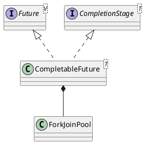

java.util.concurrent.CompletableFuture

* Unsafe

## hierarchy
```
CompletableFuture (java.util.concurrent)
    Completable in Callback (org.eclipse.jetty.util)
    Completable in Promise (org.eclipse.jetty.util)
    DelegatingCompletableFuture (org.springframework.util.concurrent)
    ServiceFuture (com.microsoft.rest.v2)
CompletableFuture (java.util.concurrent)
    CompletionStage (java.util.concurrent)
    Future (java.util.concurrent)
    Object (java.lang)
```

## define


```java
public class CompletableFuture<T> implements Future<T>, CompletionStage<T> {
    private static final Executor asyncPool = useCommonPool ?
        ForkJoinPool.commonPool() : new ThreadPerTaskExecutor();   
    
    // Modes for Completion.tryFire. Signedness matters.
    static final int SYNC   =  0;
    static final int ASYNC  =  1;
    static final int NESTED = -1;
}
```

## methods

### runAsync
```java
    public static <U> CompletableFuture<U> supplyAsync(Supplier<U> supplier) {
        return asyncSupplyStage(asyncPool, supplier);
    }
        
    public static CompletableFuture<Void> runAsync(Runnable runnable) {
        return asyncRunStage(asyncPool, runnable);
    }
```

### supplyAsync
```java
    public static <U> CompletableFuture<U> supplyAsync(Supplier<U> supplier,
                                                       Executor executor) {
        return asyncSupplyStage(screenExecutor(executor), supplier);
    }
    
    public static CompletableFuture<Void> runAsync(Runnable runnable,
                                                   Executor executor) {
        return asyncRunStage(screenExecutor(executor), runnable);
    }    
```

### then
```java
    public <U> CompletableFuture<U> thenCompose(
        Function<? super T, ? extends CompletionStage<U>> fn) {
        return uniComposeStage(null, fn);
    }

    public <U> CompletableFuture<U> thenComposeAsync(
        Function<? super T, ? extends CompletionStage<U>> fn) {
        return uniComposeStage(asyncPool, fn);
    }

    public <U> CompletableFuture<U> thenComposeAsync(
        Function<? super T, ? extends CompletionStage<U>> fn,
        Executor executor) {
        return uniComposeStage(screenExecutor(executor), fn);
    }
```

### when
```java
    public CompletableFuture<T> whenComplete(
        BiConsumer<? super T, ? super Throwable> action) {
        return uniWhenCompleteStage(null, action);
    }

    public CompletableFuture<T> whenCompleteAsync(
        BiConsumer<? super T, ? super Throwable> action) {
        return uniWhenCompleteStage(asyncPool, action);
    }

    public CompletableFuture<T> whenCompleteAsync(
        BiConsumer<? super T, ? super Throwable> action, Executor executor) {
        return uniWhenCompleteStage(screenExecutor(executor), action);
    }
```

### exceptionally
```java
    public CompletableFuture<T> exceptionally(
        Function<Throwable, ? extends T> fn) {
        return uniExceptionallyStage(fn);
    }
```