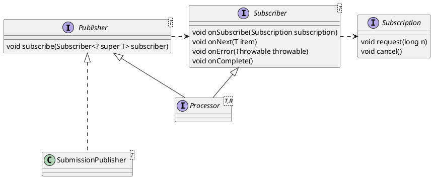

java.util.concurrent.Flow

## Define

```plantuml
@startuml

interface Publisher<T> {
    void subscribe(Subscriber<? super T> subscriber)
}

interface Subscriber<T> {
    void onSubscribe(Subscription subscription)
    void onNext(T item)
    void onError(Throwable throwable)
    void onComplete()
}

interface Subscription {
    void request(long n)
    void cancel()
}

interface Processor<T,R>

Subscriber ^-- Processor
Publisher ^-- Processor

Publisher .> Subscriber
Subscriber .> Subscription

class SubmissionPublisher<T>
Publisher ^... SubmissionPublisher

@enduml
```