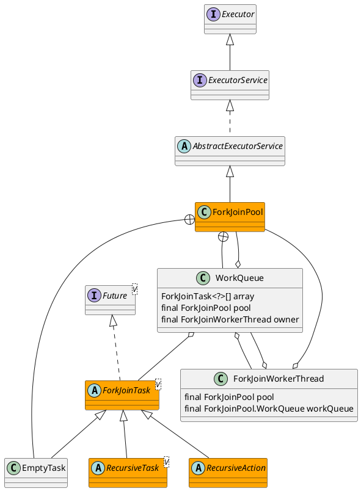

java.util.concurrent.ForkJoinPool

并行执行任务的框架，把一个大任务**分割**成若干个小任务，最终**汇总**没个小任务结果后得到大任务结果的框架。

## hierarchy
```
AbstractExecutorService (java.util.concurrent)
    ForkJoinPool (java.util.concurrent)
ForkJoinPool (java.util.concurrent)
    AbstractExecutorService (java.util.concurrent)
        Object (java.lang)
        ExecutorService (java.util.concurrent)
            Executor (java.util.concurrent)
```

## define
* ForkJoinPool
* ForkJoinTask
  * RecursiveAction 没有返回结果的任务
  * RecursiveTask 有返回结果的任务
* ForkJoinWorkerThread



## methods

### submit
```java
    public <T> ForkJoinTask<T> submit(ForkJoinTask<T> task) {
        if (task == null)
            throw new NullPointerException();
        externalPush(task);
        return task;
    }
```

### externalPush
```java
    final void externalPush(ForkJoinTask<?> task) {
        WorkQueue[] ws; WorkQueue q; int m;
        int r = ThreadLocalRandom.getProbe();
        int rs = runState;
        if ((ws = workQueues) != null && (m = (ws.length - 1)) >= 0 &&
            (q = ws[m & r & SQMASK]) != null && r != 0 && rs > 0 &&
            U.compareAndSwapInt(q, QLOCK, 0, 1)) {
            ForkJoinTask<?>[] a; int am, n, s;
            if ((a = q.array) != null &&
                (am = a.length - 1) > (n = (s = q.top) - q.base)) {
                int j = ((am & s) << ASHIFT) + ABASE;
                U.putOrderedObject(a, j, task);
                U.putOrderedInt(q, QTOP, s + 1);
                U.putIntVolatile(q, QLOCK, 0);
                if (n <= 1)
                    signalWork(ws, q);
                return;
            }
            U.compareAndSwapInt(q, QLOCK, 1, 0);
        }
        externalSubmit(task);
    }
```

### helpComplete

### helpStealer


## inner  class

### ForkJoinWorkerThreadFactory
```java
    public static interface ForkJoinWorkerThreadFactory {
        /**
         * Returns a new worker thread operating in the given pool.
         *
         * @param pool the pool this thread works in
         * @return the new worker thread
         * @throws NullPointerException if the pool is null
         */
        public ForkJoinWorkerThread newThread(ForkJoinPool pool);
    }
```

### DefaultForkJoinWorkerThreadFactory
```java
    static final class DefaultForkJoinWorkerThreadFactory
        implements ForkJoinWorkerThreadFactory {
        public final ForkJoinWorkerThread newThread(ForkJoinPool pool) {
            return new ForkJoinWorkerThread(pool);
        }
    }
```

### EmptyTask
```java
    static final class EmptyTask extends ForkJoinTask<Void> {
        private static final long serialVersionUID = -7721805057305804111L;
        EmptyTask() { status = ForkJoinTask.NORMAL; } // force done
        public final Void getRawResult() { return null; }
        public final void setRawResult(Void x) {}
        public final boolean exec() { return true; }
    }
```