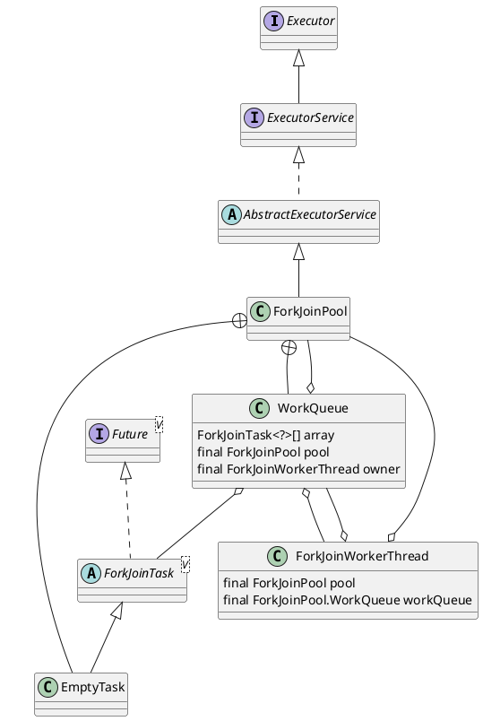

java.util.concurrent.ForkJoinPool

## hierarchy
```
AbstractExecutorService (java.util.concurrent)
    ForkJoinPool (java.util.concurrent)
ForkJoinPool (java.util.concurrent)
    AbstractExecutorService (java.util.concurrent)
        Object (java.lang)
        ExecutorService (java.util.concurrent)
            Executor (java.util.concurrent)
```

## define
* ForkJoinPool
* ForkJoinTask
* ForkJoinWorkerThread

