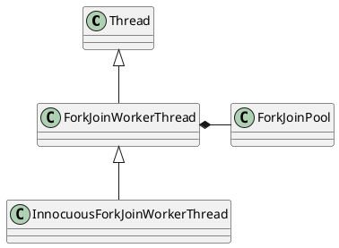

java.util.concurrent.ForkJoinWorkerThread

## hierarchy
```
Thread (java.lang)
    ForkJoinWorkerThread (java.util.concurrent)
        InnocuousForkJoinWorkerThread in ForkJoinWorkerThread (java.util.concurrent)
        SafeForkJoinWorkerThread in SafeForkJoinWorkerThreadFactory (org.apache.catalina.startup)
```

## define
