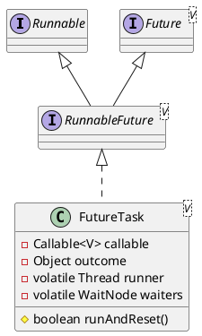

java.util.concurrent.FutureTask

## hierarchy
```
FutureTask (java.util.concurrent)
    Object (java.lang)
    RunnableFuture (java.util.concurrent)
        Future (java.util.concurrent)
        Runnable (java.lang)
```

## define
