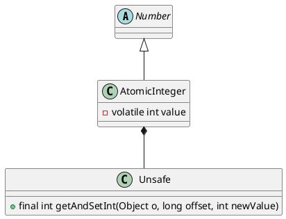

java.util.concurrent.atomic.AtomicInteger

* volatile int
* cas
* for/while

## hierarchy
```
Number (java.lang)
    AtomicInteger (java.util.concurrent.atomic)
```

## define


## fields
```java
    private static final Unsafe unsafe = Unsafe.getUnsafe();
    private static final long valueOffset;

    static {
        try {
            valueOffset = unsafe.objectFieldOffset
                (AtomicInteger.class.getDeclaredField("value"));
        } catch (Exception ex) { throw new Error(ex); }
    }

    private volatile int value;
```
## methods

### getAndIncrement

```java
    public final int getAndIncrement() {
        return unsafe.getAndAddInt(this, valueOffset, 1);
    }
    
    // Unsafe cas + while 
    // 超时重试幂等、限流降级熔断、并发缓存异步队列
    public final int getAndSetInt(Object o, long offset, int newValue) {
        int v;
        do {
            v = getIntVolatile(o, offset);
        } while (!compareAndSwapInt(o, offset, v, newValue));
        return v;
    }
```

## inner class

### Unsafe
* getAndSetInt
* getIntVolatile
* compareAndSwapInt
* getObjectVolatile
* getAndSetObject
* compareAndSwapObject

```java
    public final Object getAndSetObject(Object o, long offset, Object newValue) {
        Object v;
        do {
            v = getObjectVolatile(o, offset);
        } while (!compareAndSwapObject(o, offset, v, newValue));
        return v;
    }
```