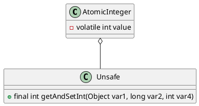

java.util.concurrent.atomic.AtomicInteger

* volatile int
* cas
* for/while

## hierarchy
```
Number (java.lang)
    AtomicInteger (java.util.concurrent.atomic)
```

## define


## fields
```java
    private static final Unsafe unsafe = Unsafe.getUnsafe();
    private static final long valueOffset;

    static {
        try {
            valueOffset = unsafe.objectFieldOffset
                (AtomicInteger.class.getDeclaredField("value"));
        } catch (Exception ex) { throw new Error(ex); }
    }

    private volatile int value;
```
## methods

### getAndIncrement

```java
    public final int getAndIncrement() {
        return unsafe.getAndAddInt(this, valueOffset, 1);
    }
    
    // Unsafe cas + while 
    // 超时重试幂等、限流降级熔断、并发缓存异步队列
    public final int getAndAddInt(Object var1, long var2, int var4) {
        int var5;
        do {
            var5 = this.getIntVolatile(var1, var2);
        } while(!this.compareAndSwapInt(var1, var2, var5, var5 + var4));

        return var5;
    }
```

## inner class

### Unsafe
* getAndSetInt
* getIntVolatile
* compareAndSwapInt


* getObjectVolatile
* getAndSetObject
* compareAndSwapObject

```java
public final Object getAndSetObject(Object var1, long var2, Object var4) {
    Object var5;
    do {
        var5 = this.getObjectVolatile(var1, var2);
    } while(!this.compareAndSwapObject(var1, var2, var5, var4));

    return var5;
}
```