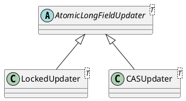

java.util.concurrent.atomic.AtomicLongFieldUpdater

## hierarchy
```
AtomicLongFieldUpdater (java.util.concurrent.atomic)
    CASUpdater in AtomicLongFieldUpdater (java.util.concurrent.atomic)
    LockedUpdater in AtomicLongFieldUpdater (java.util.concurrent.atomic)
    UnsafeAtomicLongFieldUpdater (com.alibaba.rocketmq.shade.io.netty.util.internal)
```
## define



## methods

### newUpdater
配合volatile使用
```java
@CallerSensitive
public static <U> AtomicLongFieldUpdater<U> newUpdater(Class<U> tclass,
                                                       String fieldName) {
    Class<?> caller = Reflection.getCallerClass();
    if (AtomicLong.VM_SUPPORTS_LONG_CAS)
        return new CASUpdater<U>(tclass, fieldName, caller);
    else
        return new LockedUpdater<U>(tclass, fieldName, caller);
}
```