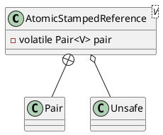

java.util.concurrent.atomic.AtomicStampedReference

AtomicStampedReference可以原子更新两个值：引用和版本号，通过版本号来区别节点的循环使用

## define

```plantuml
@startuml

class AtomicStampedReference<V> {
    - volatile Pair<V> pair
}

AtomicStampedReference +-- Pair
AtomicStampedReference o-- Unsafe

class Unsafe

@enduml
```

### Unsafe
* compareAndSwapObject