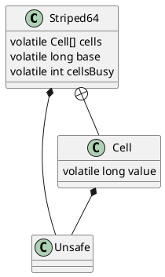

java.util.concurrent.atomic.Striped64

* 支持累加器的并发计数组件
* 分段锁，在竞争激烈的时候尽量分散竞争

## hierarchy
```
Number (java.lang)
    Striped64 (java.util.concurrent.atomic)
        LongAdder (java.util.concurrent.atomic)
            LongAdderCounter (io.netty.util.internal)
            LongAdderCounter (io.netty.util.internal)
        LongAccumulator (java.util.concurrent.atomic)
        DoubleAdder (java.util.concurrent.atomic)
        DoubleAccumulator (java.util.concurrent.atomic)
```

## define
