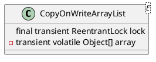

java.util.concurrent.CopyOnWriteArrayList

* volatile
* ReentrantLock
- 读写分离
- 最终一致
- 使用另外开辟空间的思路，来解决并发冲突

## define


## methods

### add()
```java
public boolean add(E e) {
    final ReentrantLock lock = this.lock;
    lock.lock();
    try {
        Object[] elements = getArray();
        int len = elements.length;
        Object[] newElements = Arrays.copyOf(elements, len + 1);
        newElements[len] = e;
        setArray(newElements);
        return true;
    } finally {
        lock.unlock();
    }
}
```